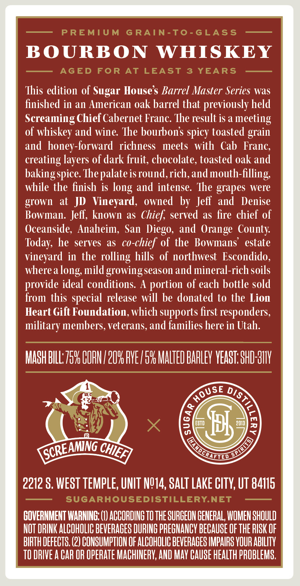
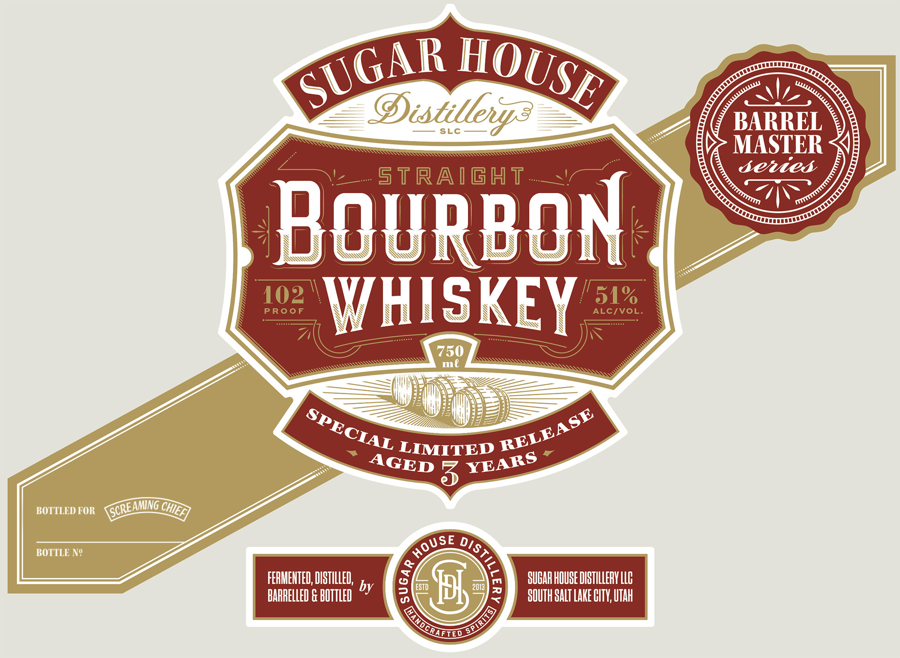
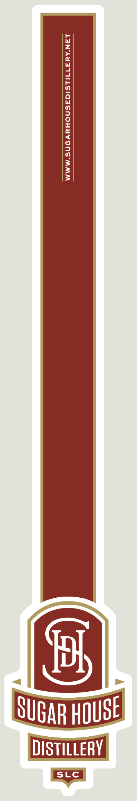

# TTB COLA Label Images - TTBID 26253001000749

**Brand Name:** SUGAR HOUSE DISTILLERY

**Issue Date:** 09/16/2026

**Origin Code:** 45

**Product Class/Type:** 101

**Source:** [TTB Public COLA Registry](https://ttbonline.gov/colasonline/viewColaDetails.do?action=publicFormDisplay&ttbid=26253001000749)

## Label Images

### Back Label

### Front Label

### Label 3

## Extracted Label Text

*Text extracted via OCR - may contain errors*

*1 image(s) excluded: text did not meet readability threshold*

**Detected Proof:** 102
**Detected Age:** 3 Years

### Back Label

PREMIUM
G RAIN-To-GLASS
BOURBON
WHISKEY
AGED
FoR
AT
LEAST
3
YEARS
This edition of Sugar House $ Barrel Master Series was
finished in an American oak barrel that previously held
Screaming Chief Cabernet Franc: The result is a meeting
of whiskey and wine: The bourbons spicy toasted grain
andhoney-forward  richness
meets
with
Cab
Franc;
creating
of dark fruit, chocolate, toasted oak and
bakingspice Thepalateisround,rich,and mouth-filling
while the finish is
and intense. The grapes were
grOwIL
at   JD   Vineyard,
owned by Jeff   and
Denise
Bowman: Jeff, known as Chief; served
as fire chief of
Oceanside; Anaheim; San  Diego, and Orange County
Today; he serves as co-chief of the Bowmans'  estate
vineyard in the rolling hills  of northwest  Escondido,
where a
mild growingseason and mineral-rich soils
provide ideal conditions A
of each bottle sold
from this special release will be donated to the Lion
Heart Gift Foundation, which supports first responders;
military members, veterans, and families here in Utah:
MaSh BILL:759 CORU / 2096 PVE /59 MALTED BARLEV VEAST.SHD H11V
SE D7
8
ESTD
pl
2013
7
5
2212 S, WEST TEMPLE, UNIT NQ14, SALT LAKE CITY; UT 84115
SUGARHOUSEDISTILLERYNET
GOVERNMENT IARNING: (1) ACCORDING TO THE SURGEON GENERAL, WOMEN SHOULD
NOT DRINK ALCOHOLIC BEVERACES DURING PRECHANCY BECAUSE OF THE RISK OF
BIRTH DEFECTS, (2) COHSUMPTION OF ALCOHOLIC BEVERACES IMPAIRS YOUR ABILITV
TO DRIVE A CaR OR OpERATe MACHINERY; AND May Cause HeaLTh PROBLEMS,
layers
long
long
portion
HoU
1

SCREAMNG =
SPIRIT
CHIEFI
NDcRuETED

### Front Label

Oistillev?
SLC
BARREL
MASTER
senied
straight
BoURBOn
102
PRooF
WHISKEY
ALCIVOL.
51%
750
ml
LIMITED
3
BOTTLED FOR
AMING
BOTTLE Ne
FERMEHTED; DISTILLED;
SUCAR HOUBE DISTILLERY LLC
by
2013
BARRELLED & BOTTLED
3
2
SOUTH SALT LAKE HT; Utah
SUGAR
HOUSE
SPECIAL
RELEASE
YEARS
AGED
CHIEF]
SCREA
HOUSE
9
3
[anochiico
SPIRUIS
