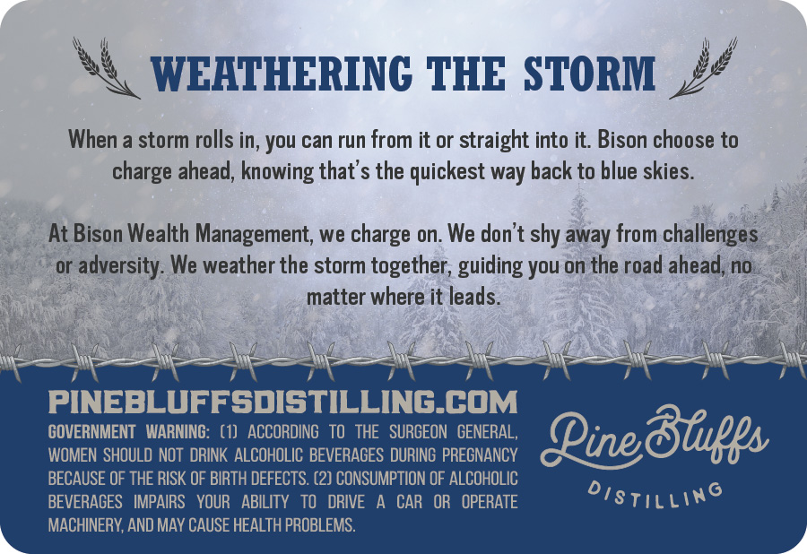
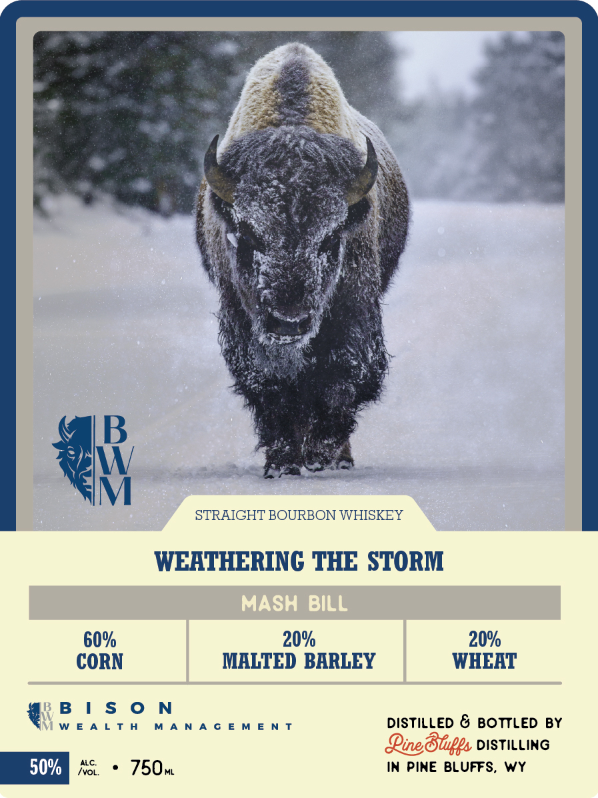

# TTB COLA Label Images - TTBID 26253001000787

**Brand Name:** BISON WEALTH MANAGEMENT

**Fanciful Name:** WEATHERING THE STORM

**Issue Date:** 09/16/2026

**Origin Code:** 49

**Product Class/Type:** 101

**Source:** [TTB Public COLA Registry](https://ttbonline.gov/colasonline/viewColaDetails.do?action=publicFormDisplay&ttbid=26253001000787)

## Label Images

### Back Label

### Label 1

### Label 3

## Extracted Label Text

*Text extracted via OCR - may contain errors*

### Back Label

WEATHERINC THE STORM
When a storm rolls in; You can run from it or straight into it: Bison choose to
charge ahead; knowing that's the quickest way back to blue skies
At Bison Wealth Management; we charge on. We don't shy away from challenges
or
adversity: We weather the storm together; guiding you on the road ahead, no
matter where it leads.
PINEBLUFFsDISTILLING_COM
GOVERNMENT   WARNING:   (1)   ACCORDING   TO   THE   SURGEON   GENERAL,
Pine8fugs
WOMEN  SHOULD NOT  DRINK ALCOHOLIC BEVERAGES DURING PREGNANCY
BECAUSE OF THE RISK OF BIRTH DEFECTS. (2) CONSUMPTION OF ALCOHOLIC
BEVERAGES
IMPAIRS
YOUR
ABILITY
TO
DRIVE
CAR   OR
OPERATE
distilling
MACHINERY, AND MAY CAUSE HEALTH PROBLEMS:

### Label 1

STRAIGHT BOURBON WHISKEY

WEATHERING THE STORM

60% 20% 20%

CORN MALTED BARLEY WHEAT
'BIS ON
ViWEALTH MANAGEMENT DISTILLED & BOTTLED BY

Line Bluffs vistIine
no. * 750m IN PINE BLUFFS, WY

### Label 3

WEHTHERINC THE STORM
BARREL PICK
