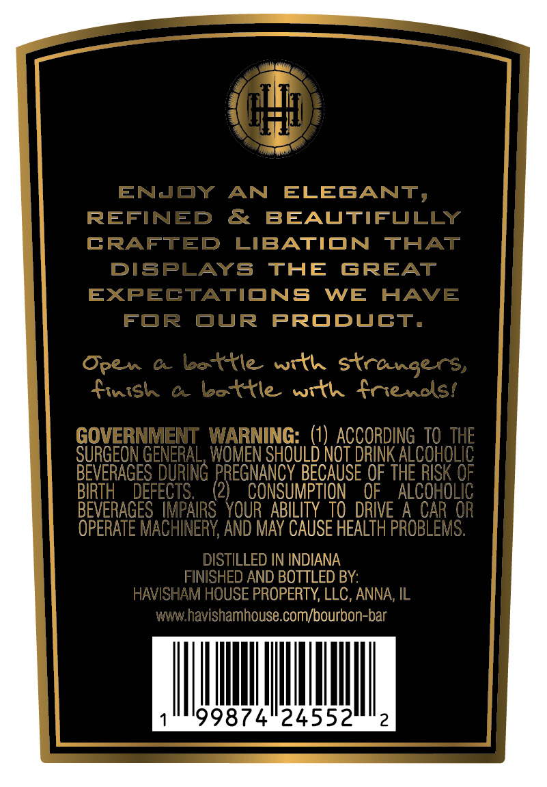
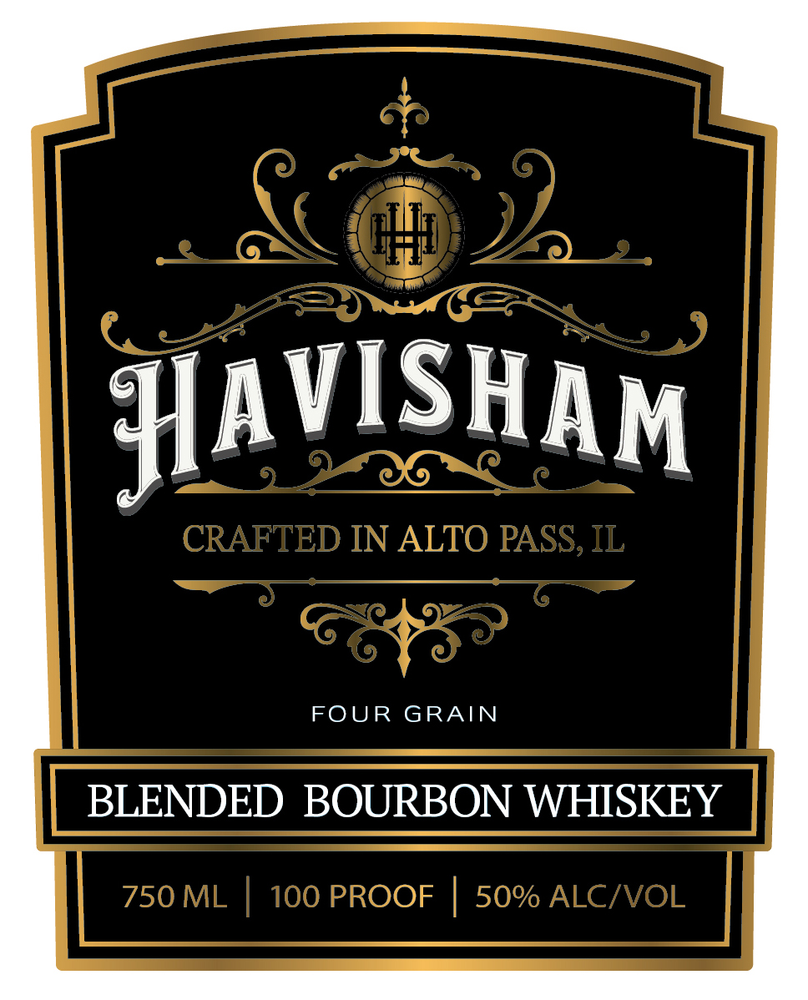
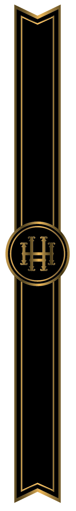

# TTB COLA Label Images - TTBID 26253001000813

**Brand Name:** HAVISHAM

**Issue Date:** 09/16/2026

**Origin Code:** 04

**Product Class/Type:** 131

**Source:** [TTB Public COLA Registry](https://ttbonline.gov/colasonline/viewColaDetails.do?action=publicFormDisplay&ttbid=26253001000813)

## Label Images

### Back Label

### Front Label

### Label 3

## Extracted Label Text

*Text extracted via OCR - may contain errors*

*1 image(s) excluded: text did not meet readability threshold*

**Detected Proof:** 100

### Back Label

ENJOY
AN
ELEGANT,
REFINED
&
BEAUTIFULLY
CRAFTED
LIBATION
THAT
DISPLAYS
THE
GREAT
EXPECTATIONS
WE
HAVE
FOR
OUR
PRODUCT,
Open
C
bottle
with strangers,
finish
0
bottle with friencsi
GOVERNMENT WARNING: (1) ACCORDING TO THE
SURGEON GENERAL, Women SHOULD NOT DRINK ALcohOLIC
BEVERAGES_DURING PREGNANCY BECAUSE OF THE RISK 0F
BIRTH
DEFECTS:
2)
CONSUMPTION
OF
ALCOHOLIC
BEVERAGES  IMPAIRS   YOUR  ABILITY  TO DRIVE
A CAR OR
OPERATE MACHINERY, AND May CAUSE HEALTH PROBLEMS.
DISTILLED IN INDIANA
FINISHED AND BOTTLED BY:
HAVISHAM HOUSE PROPERTY; LLC, ANNA, IL
whavishamhouse com/bourbon-bar
99874"24552
2

### Front Label

HAVISHAM
CRAFTED IN ALTO PASS; IL
FOUR
GRAIN
BLENDED BOURBON WHISKEY
750 ML
100 PROOF
50% ALCIVOL
