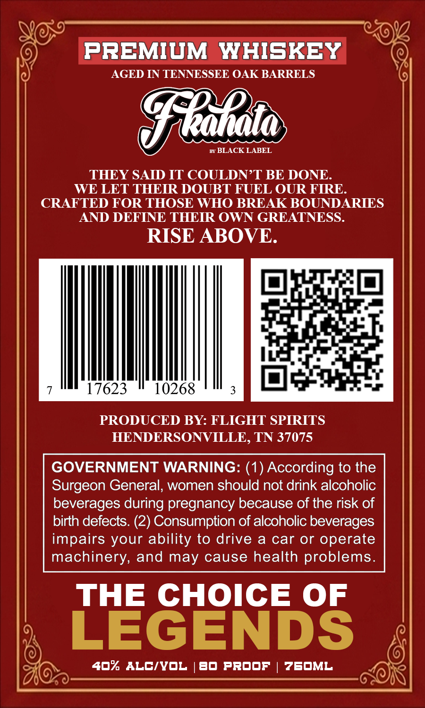
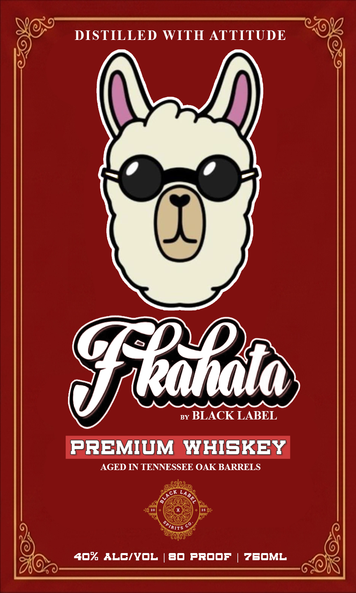

# TTB COLA Label Images - TTBID 26253001000835

**Brand Name:** BLACK LABEL

**Issue Date:** 09/16/2026

**Origin Code:** 43

**Product Class/Type:** 140

**Source:** [TTB Public COLA Registry](https://ttbonline.gov/colasonline/viewColaDetails.do?action=publicFormDisplay&ttbid=26253001000835)

## Label Images

### Back Label

### Front Label

## Extracted Label Text

*Text extracted via OCR - may contain errors*

**Detected Proof:** 80

### Back Label

PREMIUM WHISKEY
AGED IN TENNESSEE OAK BARRELS
Fllato
BLACK LABEL
THEY SAID IT COULDN T BE DONE.
WE LET THEIR DOUBT FUEL OUR FIRE.
CRAFTED FOR THOSE WHO BREAK BOUNDARIES
AND DEFINE THEIR OWN GREATNESS.
RISE ABOVE.
17623
10268
3
PRODUCED BY: FLIGHT SPIRITS
HENDERSONVILLE, TN 37075
GOVERNMENT WARNING: (1) According to the
Surgeon General, women should not drink alcoholic
beverages during pregnancy because of the risk f
birth defects: (2) Consumption of alcoholic beverages
impairs your ability to drive a
car or
operate
machinery, and may cause health problems
THE CHOICE OF
LEGENDS
4O* ALCIvOL
BO PROOF
7EOML

### Front Label

DISTILLED WITH ATTITUDE
Hello
BY
BLACK LABEL
PREMIUM WHISKEY
AGED IN TENNESSEE OAK BARRELS
40% ALCIvOL
BO PROOF
ZBOML
JaTTs
Ite
