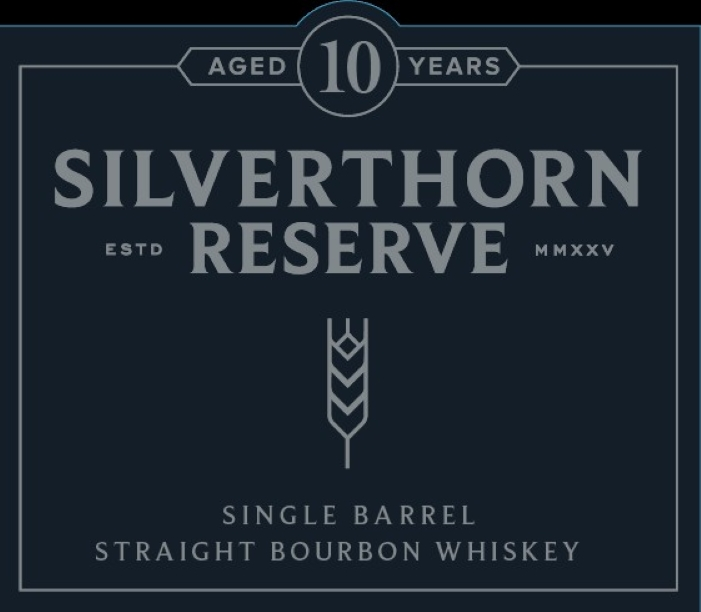

# TTB COLA Label Images - TTBID 26253001000837

**Brand Name:** SILVERTHORN RESERVE

**Fanciful Name:** SINGLE BARREL

**Issue Date:** 09/16/2026

**Origin Code:** 25

**Product Class/Type:** 101

**Source:** [TTB Public COLA Registry](https://ttbonline.gov/colasonline/viewColaDetails.do?action=publicFormDisplay&ttbid=26253001000837)

## Label Images

### Back Label

### Front Label

## Extracted Label Text

*Text extracted via OCR - may contain errors*

*1 image(s) excluded: text did not meet readability threshold*

**Detected Age:** 10 Years

### Front Label

AGED
10
YEARS
SILVERTHORN
Estd
RESERVE
MMXXv
SINGLE BA RREL
STRAIGHT BOURBON WHISKEY
