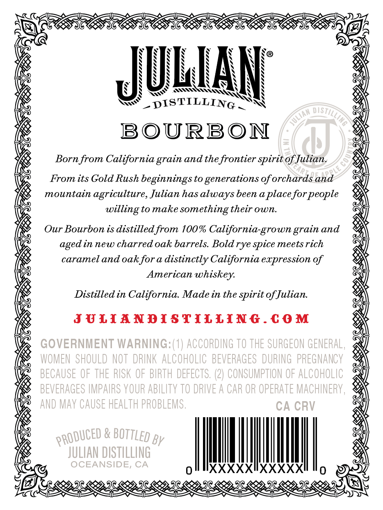
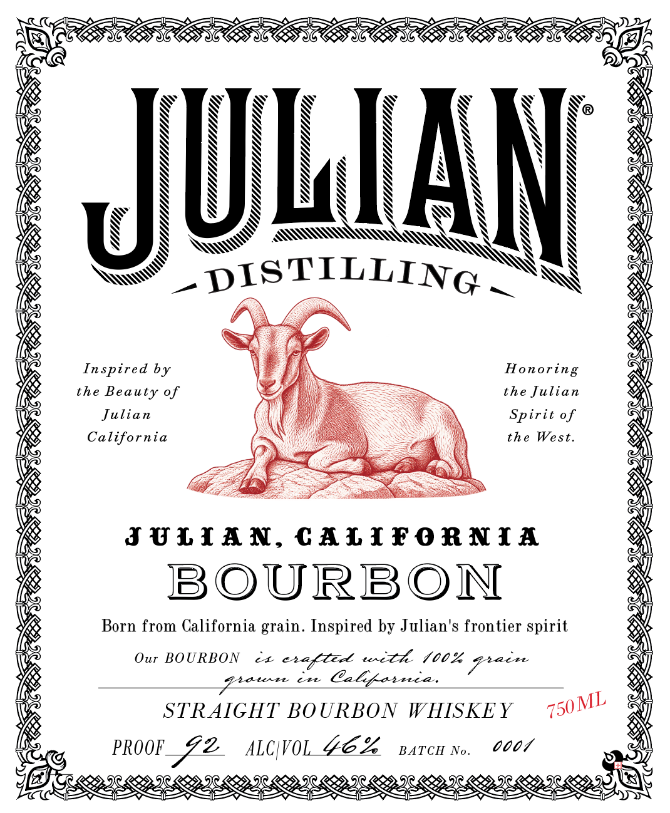

# TTB COLA Label Images - TTBID 26254001000239

**Brand Name:** JULIAN DISTILLING

**Issue Date:** 09/30/2026

**Origin Code:** 01

**Product Class/Type:** 101

**Source:** [TTB Public COLA Registry](https://ttbonline.gov/colasonline/viewColaDetails.do?action=publicFormDisplay&ttbid=26254001000239)

## Label Images

### Back Label

### Front Label

### Label 2

## Extracted Label Text

*Text extracted via OCR - may contain errors*

### Back Label

HA
DISTILLING
BOURBON
Born from California
and thefrontier spirit of Julian.
From its Gold Rush beginnings to generations
oforchards and
mountain
agriculture, Julian has always been aplaceforpeople
to make
something their own.
Our Bourbon is distilled from 100% California-grown
and
in new charred oak barrels Bold rye spice meets rich
caramel and oakfor a distinctly California expression of
American whiskey:
Distilled in California Made in the spirit ofJulian.
JULIANDISTILLInG
C 0 M
GOVERNMENT WARNING:(1) ACCORDING TO thE SURGEON GENERAL,
WOMEN  SHOULD NOT  DRINK ALCOHOLIC   BEVERAGES   DURING   PREGNANCY
BECAUSE OF THE RISK OF BIRTH DEFECTS. (2) CONSUMPTION OF ALCOHOLIC
BEVERAGES IMPAIRS YOUR ABILITY TO dRIVE A CAR OR OpERATE MACHINERY ,
AND May CAUSE HEALTH PROBLEMS ,
CA CRV
By
JULIAN DISTILLING
OCEANSIDE, CA
0
XXXXXIXXXXX
0
ISTIC
grain
willing
grain
aged
PRODUCED
BOTTLed

### Front Label

=o

CGS
Q

® %

OKi

Be

SD

Nes
CRY
ec

VILULILUULLUALLULL UU,

WLM LM hy,
ZZ

N
\
N
\

\
IOWA

UMLULUMLUMLUMUUIUL bly
TCC.

(JIUILTUL

Uy

\S
AK S

WY
DISTILLING S

P=

ry
Willy
Z

Nagy

QD
OO
Zi

—_

PESOS

Inspired by J Honoring
the Beauty of E = the Julian
Julian i \ Spirit of
California \ the West.

JULIAN, CALIFORNIA

BOURBON

Born from California grain. Inspired by Julian's frontier spirit

Our BOURBON ¢x crafted ur<th (00% ere
STRAIGHT BOURBON WHISKEY 750 ML

PROOF_ZZ ALCWOL ZEA arcu no. 0007

### Label 2

SHJaNnoj
(lqopo
5
JULIAN,
SMALL BATCH
71Y1
CALIF ORNIA
B
0004
KIJ[[ISI( IJUI) #[QBU[BSnS
FROM
ABINOO?
1
b
0
3
THE =
