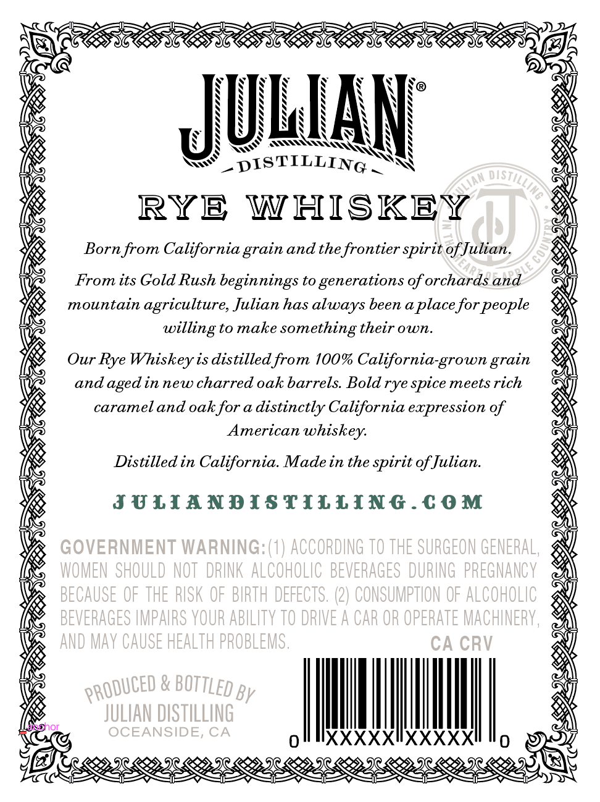
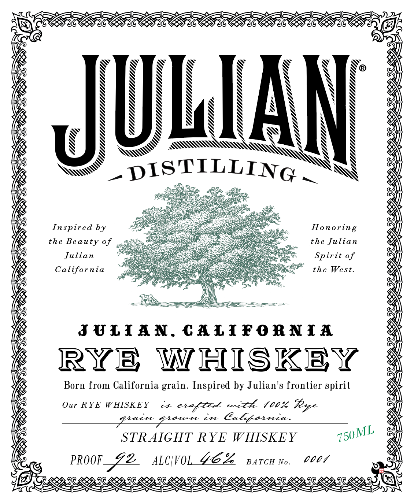
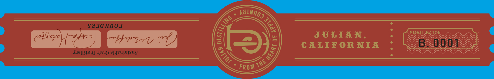

# TTB COLA Label Images - TTBID 26254001000245

**Brand Name:** JULIAN DISTILLING

**Issue Date:** 09/21/2026

**Origin Code:** 01

**Product Class/Type:** 142

**Source:** [TTB Public COLA Registry](https://ttbonline.gov/colasonline/viewColaDetails.do?action=publicFormDisplay&ttbid=26254001000245)

## Label Images

### Back Label

### Front Label

### Label 2

## Extracted Label Text

*Text extracted via OCR - may contain errors*

### Back Label

LAM
DISTILLING
RYE
WHISKEY
Bornfrom California
and thefrontier spirit of Julian.
8
From its Gold Rush beginnings to generations of orchards and
mountain
agriculture, Julian has
been aplace for
to make
something their own.
Our Rye Whiskey is distilled from 100% California-grown _
and
aged in new charred oak barrels Bold rye spice meets rich
carameland oak for & distinctly California expression of
American whiskey:
Distilled in California Made in the spirit of Julian.
JULIANDISTILLInG-€ 0M
GOVERNMENT WARNING: (1) ACCORDING TO THE SURGEON GENERAL,
WOMEN  SHOULD NOT  DRINK AlCOHOLIC   BEVERAGES  DURING   PREGNANCY
BECAUSE OF THE RISK OF BIRTH defectS, (2) CONSUMPTION OF AlCOHOLIC
BEVERAGES HMPAIRS YOUR AbilITY TO DRIVE A CAR OR OpERATe MACHINERY,
AND May CAUSE HEALTH PROBLEMS ,
CA CRV
By
JULIAN DISTILLING
Wonor
OCEANSIDE, CA
0
IXXXXXIXXXXXI
0
distil
grain
always
people
willing `
grain
PRODUCED
bOtTLed

### Front Label

ZEREEREE RES SSNS NSS SVS
ATT TTT ETON
Ye . w. : : aN
ig SAA A N y By Ws. aK
SO N N RNS
is NN NSN \ \ IANBNY  &

N Nene N N y
WR NS BN BX N@< BX Ne i N Oy
A, Ne Ne Ne WN WN N Na | A ey
s N \ N os

Win N SS Wy \ N aN,
EB URS SS’ $5 |e
te S pISTILLIng SN W
ie Ys" UL pt ING _ ‘WN a
[Xs oSteae, és etl
ve ee eee <A
Ly PC hE AMR DNRC ra cau eA
Wa Inspired by 77, Ss oe cuege Honoring |
is the Beauty of gee ae 6 © the Julian a
[Xs a al
Vis al
Ke JULIAN, CALIFORNIA a
ihe edi
® RYE WHISKEY &
ie Born from California grain. Inspired by Julian's frontier spirit x
i oN
Wa Our RYE WHISKEY cL etaflet tenet (00k Rye yl
IAD AY
ie STRAIGHT RYE WHISKEY 750M Sey
es Oe
WY? 4
[Xe gy, PROOF ZZ AWOL YEA parcnno. C007 S a
(EIRP REP, I8 P29 IR LOM. IR RD. IE LOY IR OMI OD IR LOM TR RODIN ROY sae
OT seas seasons foes seas seas siase cine

### Label 2

SHJaNnoj
(lqopo
5
JULIAN,
SMALL BATCH
71Y1
CALIF ORNIA
B
0004
KIJ[[ISI( IJUI) #[QBU[BSnS
FROM
ABINOO?
1
b
0
3
THE =
