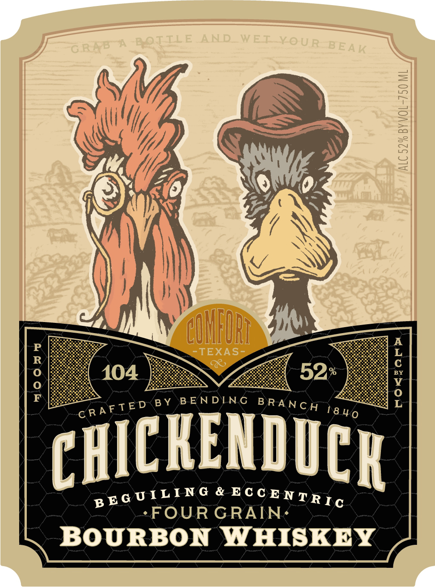
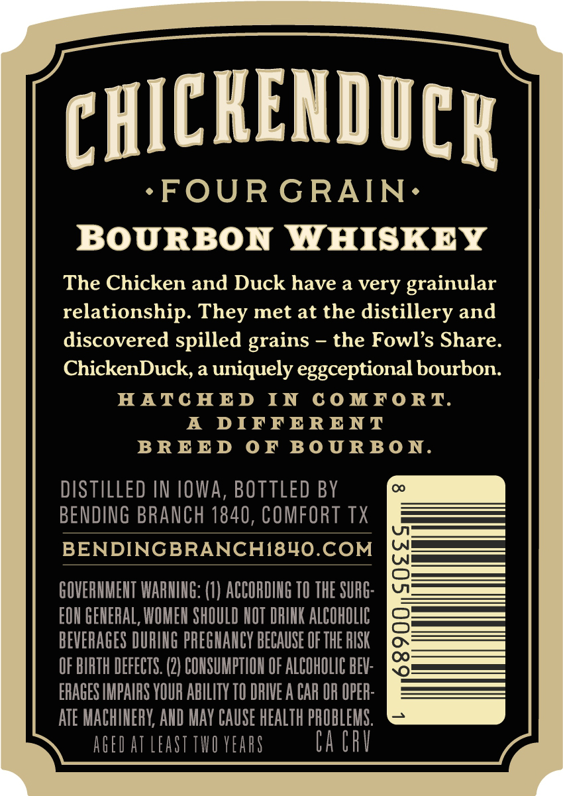
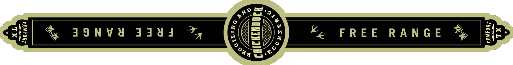

# TTB COLA Label Images - TTBID 26254001000377

**Brand Name:** CHICKENDUCK

**Fanciful Name:** FOUR GRAIN

**Issue Date:** 09/16/2026

**Origin Code:** 44

**Product Class/Type:** 141

**Source:** [TTB Public COLA Registry](https://ttbonline.gov/colasonline/viewColaDetails.do?action=publicFormDisplay&ttbid=26254001000377)

## Label Images

### Label 1

### Label 2

### Label 3

## Extracted Label Text

*Text extracted via OCR - may contain errors*

*1 image(s) excluded: text did not meet readability threshold*

### Label 1

BOTILE
AND
WET_YOUR [
3
[
8
CUHFURL
TEXAS-
:
c8
;
104
52
B Y
B E NDTN G
8
CHICKENDUCK
&
FOUR GRAIN
BOURBON
YHISKEY
G RABA
BEAK
B R ANC H
C RAF TED
18 4 0
B E G U I LING
EC C E NTRIc

### Label 2

PHICKENDUCR

*-FOUR GRAIN:

BOURBON WHISKEY

The Chicken and Duck have a very grainular

relationship. They met at the distillery and

discovered spilled grains - the Fowl’s Share.

ChickenDuck, a uniquely eggceptional bourbon.

HATCHED IN COMFORT.

A DIFFERENT

BREED OF BOURBON.

co

DISTILLED IN IOWA, BOTTLED BY

BENDING BRANCH 1840, COMFORT TX

BENDINGBRANCHI840.COM

GOVERNMENT WARNING: (1) ACCORDING 10 THE SURG

EON GENERAL, WOMEN SHOULD NOT DRINK ALCOHOLIC

BEVERAGES DURING PREGNANCY BECAUSE OF THE RISK

OF BIRTH DEFECTS. (2) CONSUMPTION OF ALCOHOLIC BEV

ERAGES IMPAIRS YOUR ABILITY 10 DRIVE A CAR OR OPER:

ATE MACHINERY, AND MAY CAUSE HEALTH PROBLEMS

AGED AT LEAST TWO YEARS

[

[
