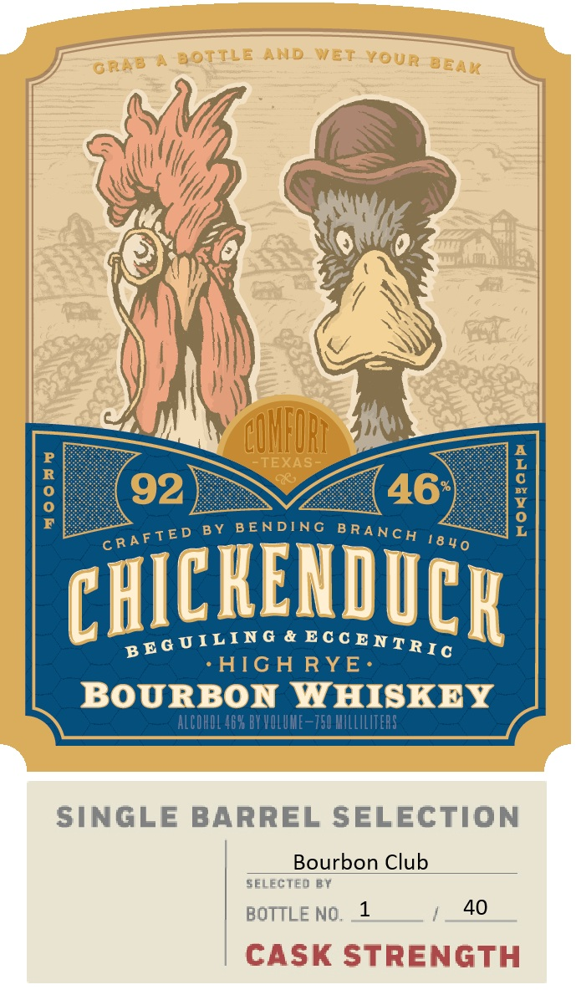
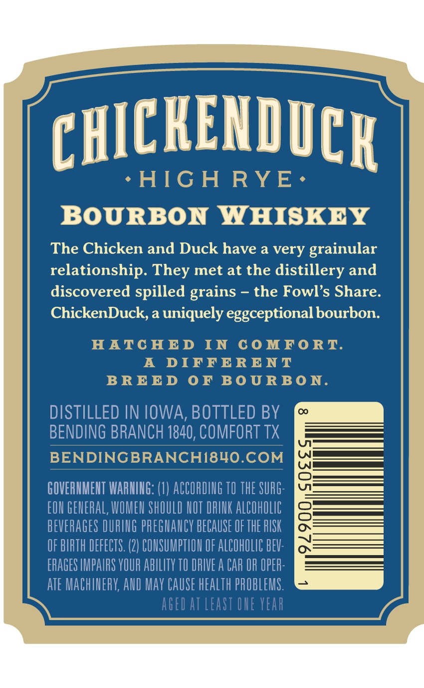
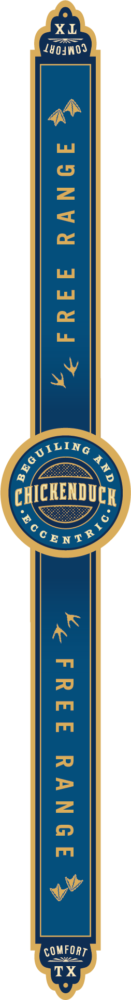

# TTB COLA Label Images - TTBID 26254001000469

**Brand Name:** CHICKENDUCK

**Fanciful Name:** HIGH RYE

**Issue Date:** 09/16/2026

**Origin Code:** 44

**Product Class/Type:** 141

**Source:** [TTB Public COLA Registry](https://ttbonline.gov/colasonline/viewColaDetails.do?action=publicFormDisplay&ttbid=26254001000469)

## Label Images

### Label 1

### Label 2

### Label 3

## Extracted Label Text

*Text extracted via OCR - may contain errors*

*1 image(s) excluded: text did not meet readability threshold*

### Label 1

BOTTLE
AND
WET
GrAB
CUHFORI
TEXAS
;
92
46
1
B Y
BENDING
CHICKENDICR
&
AIG H RYE.
BOURBON WHISKEY
ALCOHOL 46X BY VOLURE=750 MLLILITERS
SINGLE BARREL SELECTION
Bourbon Club
SELECTED BY
BOTTLE NO,
40
CASK STrREnGTH
YouR
BEAK
B RA NC H
CRAFTE D
18 4 0
B EG UILING
Ec c ENTRIc

### Label 2

CHICKENDICR
HIG H
RYE
BOURBON WHISKEY
The Chicken and Duck have a very
grainular
relationship. They met at the distillery and
discovered spilled grains
the Fowl's Share.
ChickenDuck, a uniquely eggceptional bourbon.
HATC HED
IN
C0 MFORT
A
DIFFERENT
BR EE D
0F BoURBO N.
DISTILLED IN IOWA, BOTTLED BY
BENDING BRANCH 1840, COMFORT TX
BENDINGBRANCHI84O.COM
GOVERHMEHT WARMIHG: (1) ACCORDING TO THE SURG:
EOU GENERAL, WOMEN ShOULD HOT DRINK ALCOHOLIC

BEVERAGES DURIG PREGHAUCY BECAUSE OF THE BISK
OF BIRTH DEFECTS. (2) COHSUMPTIH OF ALCOHOLIC BEV:
ERAGES IMPAIRS VOUR AbILITY TO RIVE A CAR OR OPER:
ATE MACHIERY; AUD May CAUSe health PROBLEMS.
AGEd at East OUE vear
