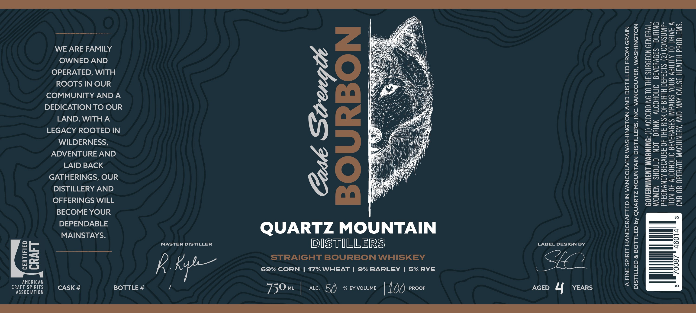

# TTB COLA Label Images - TTBID 26254001000514

**Brand Name:** QUARTZ MOUNTAIN DISTILLERS

**Fanciful Name:** CASK STRENGTH BOURBON

**Issue Date:** 09/17/2026

**Origin Code:** 07

**Product Class/Type:** 101

**Source:** [TTB Public COLA Registry](https://ttbonline.gov/colasonline/viewColaDetails.do?action=publicFormDisplay&ttbid=26254001000514)

## Label Images

### Label 1

### Label 2

## Extracted Label Text

*Text extracted via OCR - may contain errors*

*1 image(s) excluded: text did not meet readability threshold*

**Detected Proof:** 100
**Detected Age:** 4 Years

### Label 1

CRAFT

AMERICAN
CRAFT SPIRITS
ASSOCIATION

WE ARE FAMILY
OWNED AND
OPERATED, WITH
ROOTS IN OUR
COMMUNITY AND A
DEDICATION TO OUR
LAND. WITHA
LEGACY ROOTED IN
WILDERNESS,
ADVENTURE AND
LAID BACK
GATHERINGS, OUR
DISTILLERY AND
OFFERINGS WILL
BECOME YOUR
DEPENDABLE
MAINSTAYS.

CASK # BOTTLE #

MASTER DISTILLER

Rk

/

te
BON

Cask So
BOUR

QUARTZ MOUNTAIN
DISTILLERS forty

STRAIGHT BOURBON WHISKEY FO
69% CORN | 17% WHEAT | 9% BARLEY | 5% RYE

750 ML ALC. 5O % BY VOLUME | 100 PROOF AGED 4 YEARS

A FINE SPIRIT HANDCRAFTED IN VANCOUVER WASHINGTON AND DISTILLED FROM GRAIN
DISTILLED & BOTTLED by QUARTZ MOUNTAIN DISTILLERS, INC. VANCOUVER, WASHINGTON

PREGNANCY BECAUSE OF THE RISK OF BIRTH DEFECTS. (2) CONSUMP-
TION OF ALCOHOLIC BEVERAGES IMPAIRS YOUR ABILITY TO DRIVE A
CAR OR OPERATE MACHINERY, AND MAY CAUSE HEALTH PROBLEMS.

GOVERNMENT WARNING: (1) ACCORDING TO THE SURGEON GENERAL,
WOMEN SHOULD NOT DRINK ALCOHOLIC BEVERAGES DURING

3

46014

KR
fo)
‘oO
i=)
KK

6
