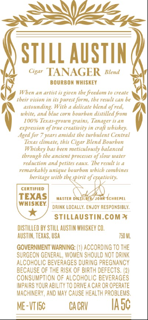
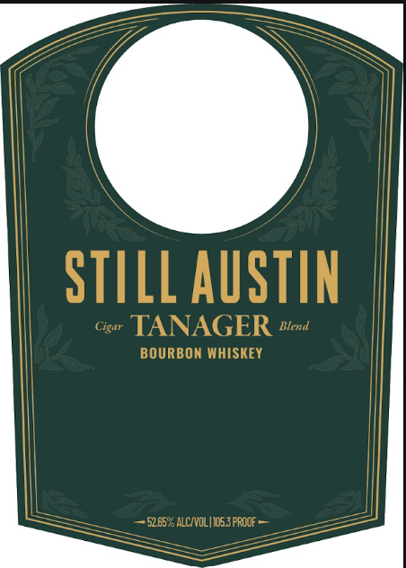
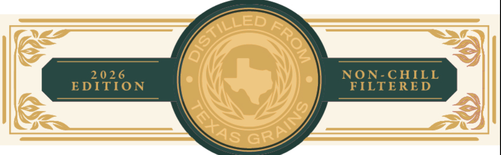

# TTB COLA Label Images - TTBID 26254001000658

**Brand Name:** STILL AUSTIN

**Fanciful Name:** TANAGER 2026 EDITION

**Issue Date:** 09/18/2026

**Origin Code:** 44

**Product Class/Type:** 141

**Source:** [TTB Public COLA Registry](https://ttbonline.gov/colasonline/viewColaDetails.do?action=publicFormDisplay&ttbid=26254001000658)

## Label Images

### Back Label

### Front Label

### Label 2

### Label 3

## Extracted Label Text

*Text extracted via OCR - may contain errors*

*1 image(s) excluded: text did not meet readability threshold*

**Detected Proof:** 105.3

### Back Label

STILL AuSTIN
Cigar TANAGER
Blend
BOURBON WHISKEY
Wben an artist _
gwven tbe frcedom
crC4n
thcir vision
its purest form, the result can be
astounding
Witb _
delicate blend %f red,
ad blue corn
Rourhor
distinled Frow
JOd
TTAWS
Tanager
AA
cxpression 0 true crealivity in
wbiskey:
Aeed for
Jcet
amidst the turbulent Ccntral
cliaate; Ebis Cigar Blend Bourbon
TVTiskey Bas been
meticulousty balanced
tbrough the Ancient processes % slow water
redection
petites €<484.9, Tke vesult is 4
remarkably unique bourbon wbich combines
beritage with tbe  pirit o creativity:
certified
TEXAS
MaTR
DrVitiz joAn $CHREPEL
WHISKEY
drimk LOcALLY: EmJoy ReSPOnSibly:
STILLAUSTiN.cOMX
dISTILLED BY StILL AUSTAN WHISKEY CO;
AUSTUM; TEXAS , USA
TE0 ML
GOVERNMENT WARNING'
accordingTO THE
SURGEON GENERAL; WOMEN ShQuLD NOT DRINK
ALCOHOLIC BEVERAGES DURING PREGNANCY
BECAUSE OF THE RiSK OF BiRTH OEFECTS;
ConSUMPTION Of AlcOhOLIC BEVERAGES
MPAIRS YQUR ABULITY TO DRIVE:
ChR OR OPERATE
MACHUNERY, AND MAY CAUSE HEALTH PROBLEMS,
ME-VTIsc
CA CRV
IA 5c
#hitc,
O

### Front Label

STILL AUSTIN
Cigar
TANAGER
Blend
BOURBON MHISKEY
52.65% ALCNOL |1053 PROOF

### Label 2

20 2 6
NON-C HILL
EDITION
FILTERED
ILLED
0
ORAINS
LXAS
