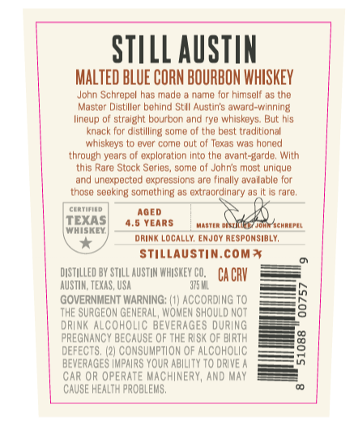
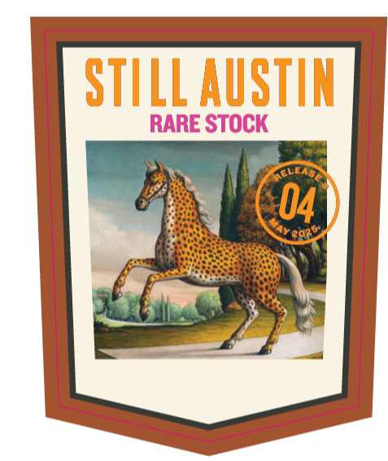
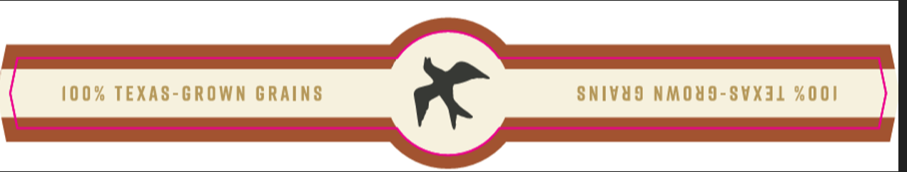
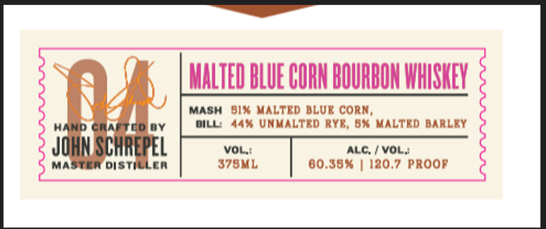

# TTB COLA Label Images - TTBID 26254001000681

**Brand Name:** STILL AUSTIN

**Fanciful Name:** RARE STOCK

**Issue Date:** 09/16/2026

**Origin Code:** 44

**Product Class/Type:** 141

**Source:** [TTB Public COLA Registry](https://ttbonline.gov/colasonline/viewColaDetails.do?action=publicFormDisplay&ttbid=26254001000681)

## Label Images

### Back Label

### Front Label

### Label 3

### Label 4

## Extracted Label Text

*Text extracted via OCR - may contain errors*

*1 image(s) excluded: text did not meet readability threshold*

**Detected Age:** 4.5 Years

### Back Label

STILL AUSTIN
MALTED BLUE CORN BOURBON WHISKEY
John Schropol has mado
nama for himsolf 05 (Ho
Master Distiller bohind StII Austin's award-wlnning
Ilnoup of stralght bourbon and ryO whiskoys; But his
knack for dlstilling somo 0f tho best traditlonal
whlskays t0 avor coma out 0l Toxas was honad
through yoars 0f exploratlon Into tho avant-Barde; WIth
thls Rara Stock Sarles, soma 0f Jonin's mast uniqua
ard unoxpoctod axprasslons aro (Inally avallable for
those sooking somothing as oxtraordinary as It
caro
CLIAILL
AGED
WEIAS]
4.5 YEARS
Mattln
MohrACHRLPLL
drink Locally; EnJOY RESPONSIBLY,
Stillaustin.comx
DUSTILLED BY STILL AUSTIN WHASKEY Co   Ca CRV
AuSTUM; TEXAS, USA
975 ML
GOVERNMENT WARNING
ACCORDING TO
tHE SURGEOM GENERAL, WoMEN ShOULD NOT
8
DRINK Alcoholic BEVERAGES DURING
PREGNANCY bECAUSE OF THE RUSK QF BURTH
DEFECTS, (21 CONSUMPTLON OF ALCOHOLC
8
BeVERAGES |mpARS YOUR ABULTY To DRUVE
CAR OR OPERATE MACHINERY, AND MAY
CAUSE HEALTH PROBLEMS ,

### Front Label

STILL AuSTIN
RARE STOCK
CLEAS
04

### Label 4

MALTEDBLUE CURMBQURBOMLHISHEV
Mash  Bix Malted BLUr CORM,
HAND Cra
CD 0Y
Dill 44% Unmalted RyR, 8% Maltrd Barley
JOHN SCHREPEL
VOL;
ALC;
VOL;
MastER Di Sti
LER
379ML
80.58*
120.7 PROOR
