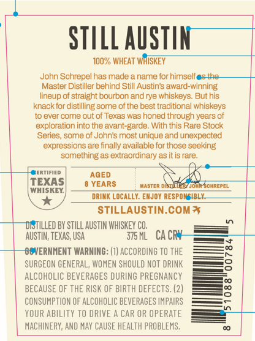
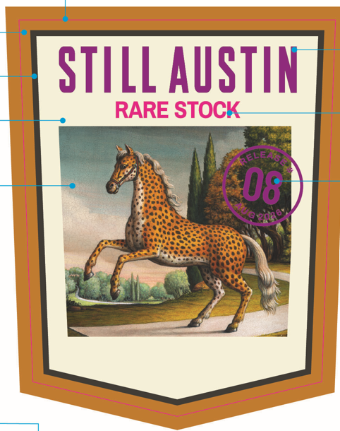
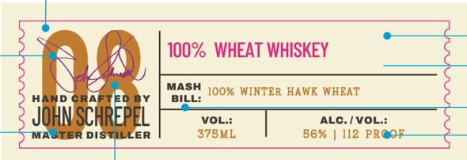
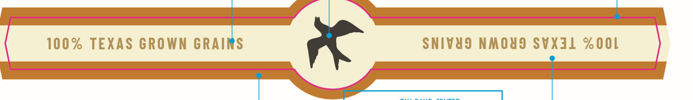

# TTB COLA Label Images - TTBID 26254001000682

**Brand Name:** STILL AUSTIN

**Fanciful Name:** RARE STOCK

**Issue Date:** 09/16/2026

**Origin Code:** 44

**Product Class/Type:** 140

**Source:** [TTB Public COLA Registry](https://ttbonline.gov/colasonline/viewColaDetails.do?action=publicFormDisplay&ttbid=26254001000682)

## Label Images

### Back Label

### Front Label

### Label 3

### Label 4

## Extracted Label Text

*Text extracted via OCR - may contain errors*

**Detected Proof:** 86

### Back Label

STILL AuSTIN
100% WHEAT WHISKEY
John Schrepel has made
name tor himselt
4A8
Master Distiller behind Still Austin s award-winning
Iineup of straight bourbon and rye whiskeys. But his
knack for distilling some of the best traditional whiskeys
t0 ever come out of Texas was honed through years of
exploration into the avant-=
With tnis Rare Stock
Series, some of John"s most unique and unexpected
expressions are finally available for those seeking
something as extraordinary as it is rare:
ERTIFIED
AGED
TEXAS
YEARS
MAETFE
Jomn CHREPEL
WHISKEY
dRIMK Locally: EMJOM RESPOR
IBLK
STILLAUSTIN.Comt
TILLED BY STILL AUSTIN WHISKEY CO,
AuSTIN; TEXAS, USA
375 ML
CA CRY
ERNHENT WARMING: (1) ACCORDING TO THE
SURGEON GENERAL, WOMEN SHOULD NOT DRINK
8
ALCOHOLIC BEVERAGES DURING PREGNANCY
BECAUSE OF THE RISK OF BIRTH DEFECTS. (2)
3
CONSUMPTION OF AlCOHOLIC BEVERAGES IMPAIRS
YOUR ABILITY TO DRIVE
CAR OR OPERATE
MACHINERY; AnD May CAUSE HEALTH PROBLEMS .
Barde;

### Front Label

STILL AuSTIN
RARE STOCK
08
ele  ^
12n46"

### Label 3

100%  WHEAT WHISKEY
MASH 100% WINTER HAWK WHEAT
HAND CR
BILL:
Johnschrepe
VOL::
ALC./VOL::
DIS-
ER
378ML
86%
112 PR

### Label 4

100% TEXAS GROWN _ SNIVUS NMOUD SVXIL ZOOL
