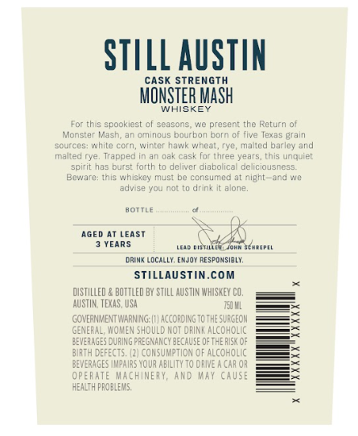
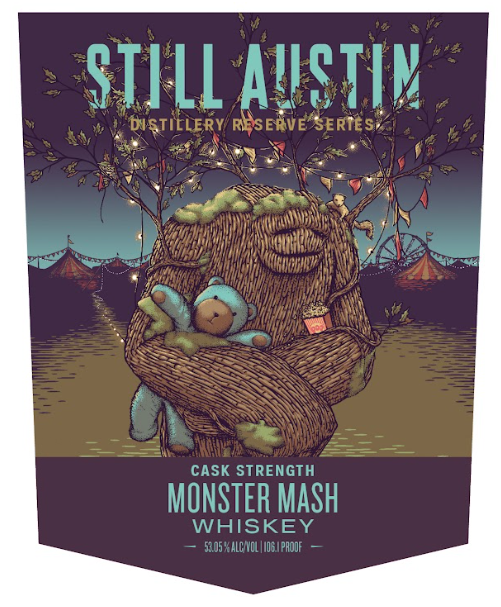
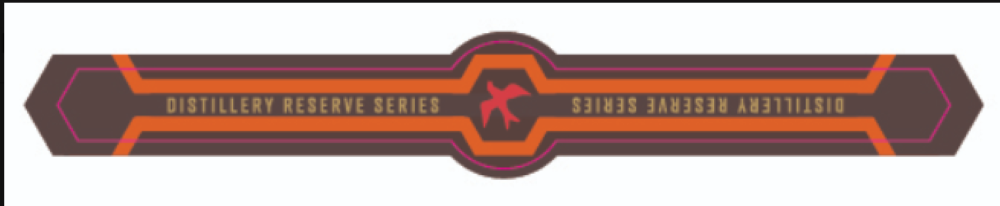

# TTB COLA Label Images - TTBID 26254001000686

**Brand Name:** STILL AUSTIN

**Fanciful Name:** DISTILLERY RESERVE SERIES MONSTER MASH

**Issue Date:** 09/16/2026

**Origin Code:** 44

**Product Class/Type:** 140

**Source:** [TTB Public COLA Registry](https://ttbonline.gov/colasonline/viewColaDetails.do?action=publicFormDisplay&ttbid=26254001000686)

## Label Images

### Back Label

### Front Label

### Label 3

## Extracted Label Text

*Text extracted via OCR - may contain errors*

### Back Label

STILL AUSTIN
CASK Strength
MONSTER MaSh
HISRE
spookiest ol scasons
present thc Return
Monster
Mash,
Gminous bourbon barn 0f Ilve lexas grain
souices: Whie
CC
Maw
wneal
Fye; malled barley
malted rye; Trapped in an oa* cask for tnree years; this unquiet
scirit has burst forth t0 deliver diabolical deliciousness
Beware: Inis whiskey must bo consumed at nient
and NC
advise /OL noI
arins
alone:
bOTtLe
Aged AT LEAST
YEARS
Ma TAlD
Johm SchePE
drink LdCALLY
dhhmt
RE SPOMSIBLY;
STilLAUSTiN.com
distILled,
BOTTLEd BW StLL AUSTIN WHISMEY CO,
AUSTN: TEMAS, USA
FI WL
COVEANMENT VNARNING: |
AccoroUNG TO ThE SURGEOM
GENERAL, YOMUEN ShOULD NOT @FUNR ALCOHOLAC
JEVERAGES DURING PREGMANCY bECAUSE OFTHE RUS <
3IRTH DEFECTS: (2) consumpTiON OF ALCOHOLIC
EWERAGES ImpaURS VOUR AbILUTY TO DRIE A CAR OR
operate Machinery, Ard
May CaUSe
HEALTH PROBAEMS;
wintci
afid

### Front Label

STI LL AUSTIK
DISTIELERY RESERVE SERTES;
cask STRENGTH
MONSTER MaSh
WHISKEY
52.05 *ALC NcL |I064phode

### Label 3

distilLeRY RESE RVE Se RIE 5
SJS ISJWIuUSIO
