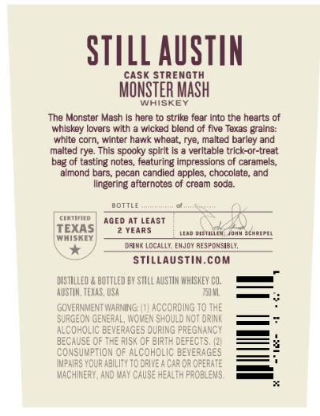
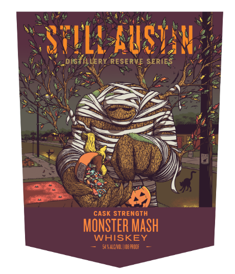

# TTB COLA Label Images - TTBID 26254001000687

**Brand Name:** STILL AUSTIN

**Fanciful Name:** DISTILLERY RESERVE SERIES MONSTER MASH

**Issue Date:** 09/18/2026

**Origin Code:** 44

**Product Class/Type:** 140

**Source:** [TTB Public COLA Registry](https://ttbonline.gov/colasonline/viewColaDetails.do?action=publicFormDisplay&ttbid=26254001000687)

## Label Images

### Back Label

### Front Label

### Label 3

## Extracted Label Text

*Text extracted via OCR - may contain errors*

*1 image(s) excluded: text did not meet readability threshold*

### Back Label

STILL AuSTIN
CASK STREnGTH
MONSTER Mash
WHISKEF
The Monster Mash is here to strike fear into the hearts of
whlskey lovers with
wicked blend of five Texas grains:
whlte corn; winter hawk wheat, rye; malted barley and
malted rye: This spooky splrit
veritable trlck-or-treat
bag of tasting notes; featuring impressions of caramels;
Ilmond bars, pecan candied apples, chocolate, and
Ilngering aftornotes
croam soda
BOTTLE
CEATIAIEC
Aged At LeAST
EXAS
YEARS
~oistiliek
Johv schreeei
MhISkEY
Dfink LOCALLY. EmJoy RESPONSIBLY
StillaUstin.com
distilled
bottled BY STULL AuSTUM MHUSKEV CO;
AUSTHN; TEXAS, USA
ISO VL
GOVERMMENT WARNING:
according To THE
SURGEON GENERAL, WOMEN ShQulD NOT DRINK
ALCOHOLIC BEVERAGES DURING PREGNANCY
BECAUSE QF THE RISk OF birth DEFECTS; (2
consumption Of AlcoholiC BEvERAGES
IkPAIRS YOUF AbilItY To DRIVE _
Car0r opeRATE
MACHUNERY, ANO MAY CaUSE HeALTH probleMS;

### Front Label

USTav
-0IS {ILLERY RESERVFE SERIES
cask STRENGTH
MONSTER MaSh
WHISKEY
SSNCNOL IId:FaODF
