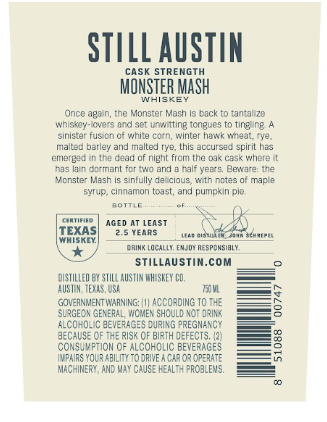
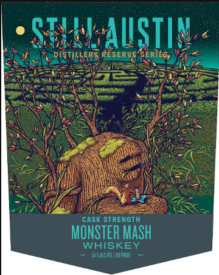
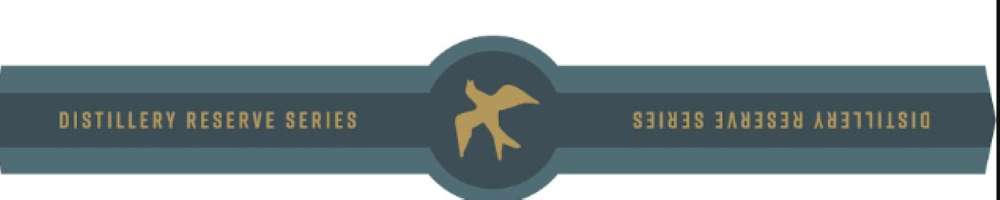

# TTB COLA Label Images - TTBID 26254001000688

**Brand Name:** STILL AUSTIN

**Fanciful Name:** DISTILLERY RESERVE SERIES MONSTER MASH

**Issue Date:** 09/18/2026

**Origin Code:** 44

**Product Class/Type:** 140

**Source:** [TTB Public COLA Registry](https://ttbonline.gov/colasonline/viewColaDetails.do?action=publicFormDisplay&ttbid=26254001000688)

## Label Images

### Back Label

### Front Label

### Label 3

## Extracted Label Text

*Text extracted via OCR - may contain errors*

*1 image(s) excluded: text did not meet readability threshold*

### Back Label

STILL AuSTIN
CaSk
STREIG
MONSTER MASH
Uncc 'pq n
tne Monator Mash
Lntj ZC
wnisasy- cvers a3d Sct Uitting tCneucs
tins ne
Siniz 9
FusOn
corn, winter hatt k Wneal tye.
nialted bailey and Iallej tye
Ihis accuisin
soicilhes
LE 4eju
night f10m the Dak Csk where
IiciaMant Ionin anj
Cal: Vepts
Beam
Ycrste- Mean
sirtui
cious "n rctes
Tacle
SMIWE
cinmamon (3a*t,anj oumo<in Dic-
€rtifine
Idast
TEXAS
TeaRs
4aichnaag
WhijrLY
Emereepousinii
STiLLAUSTiN.COM
DUSIILEH
SIILL AUSTAN MHOSKEY CD,
AUS MN: Texs; WBL
MM
GoveANIENT WarNING:
ACCORDING TO ThE
RGEC$ GEN
WCMAES SHCULD
JRin <
4LCO-olc bever4ge5 Wipixg FREGNANCT
decalse
STE RiSk CF
Irth defECTS;
Consivftioi Qf Alcokolic BeveRaGEs
1
Yol ? hbility T) drive a caror orerate
MACHINERY , AND May CruSz KealTh paCJLENS,

### Front Label

0 CTA || Ne
ANS il BI =u he
Sees ee ee
ese i oe =
Sweeter Salen e
we Lei py LAI eRe
WEN eee ae
WRC ee SS ne
BOGS Se
ek ae can GAN
AN ae
ZN Si
PN

CASK STRENGTH :

MONSTER MASH
WHISKEY
