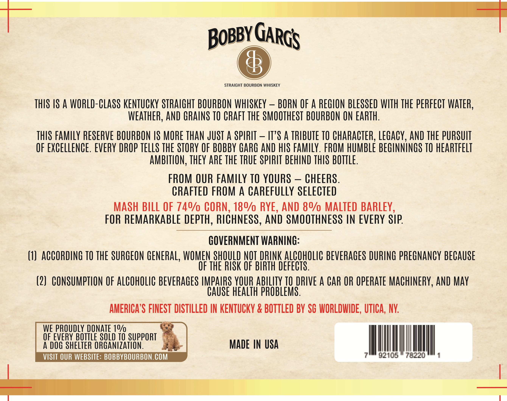
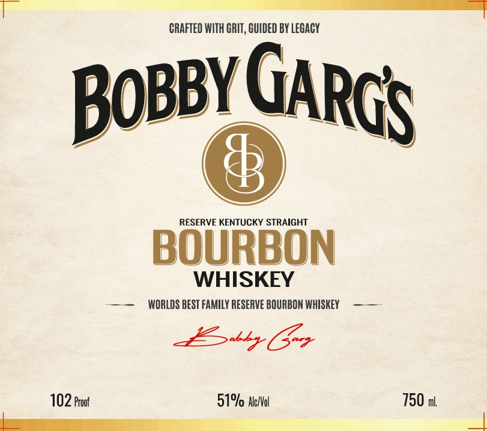

# TTB COLA Label Images - TTBID 26256001000013

**Brand Name:** BOBBY GARG

**Issue Date:** 09/16/2026

**Origin Code:** 02

**Product Class/Type:** 101

**Source:** [TTB Public COLA Registry](https://ttbonline.gov/colasonline/viewColaDetails.do?action=publicFormDisplay&ttbid=26256001000013)

## Label Images

### Back Label

### Front Label

## Extracted Label Text

*Text extracted via OCR - may contain errors*

**Detected Proof:** 102

### Back Label

BobbyC
STRAIGHT BOURBON WHISKEY
THIS IS A WORLD-CLASS KentuCKY STRAIGHT  BOURBON WHISKEY
BORN OF A REGION BLESSED WITH THE PERFECT WATER,
WEATHER, AND GRAINS TO CRAFT THE SMOOTHEST BOURBON ON EARTH:
THIS FamILY RESERVE BOURBON /S MORE THAN JUST A SPIRIT
~
IT"S A TRIBUTE TO CHARACTER, LeGacy, AND ThE PURSUIT
OF EXCELLENCE . EVERY DROP TELLS THE STORY OF BOBBY GARG AND HS FamLY. FROM HUMBLE BEGINNINGS TO heaRTFELT
AMBITLON, thEY abe ThE TRUE SPIRIT BEHIND THIS BOTTLE.
FROM OUR FamILY TO YOURS
CHEERS.
CRAFTED FROM A CarEfuLLY SELECTED
MASH BILL OF 740/ CORN, 180/0 RYE, AND &0/ MALTED BARLEY,
FOR REMARKABLe DEPTH, RICHNESS , AND SMOOTHNESS IN EVERY SIP
GOVERNMENT WARNING:
(1)  ACCORDING TO ThE SURGEON GENERAL, WOMEN SHQULD NQI DRINK ALCQHOLIC BEVERAGeS DURING ppeGnancy BECAUSE
OF THE RISK OF BIRTH DEFECTS .
(2)   CONSUMPTION OF ALCOHOLIC BEVERAGES IMPAIRS YOUR ABILITY TO DRIVE A CAR OR Operate MachinERY,AND May
CAUSE health pROBLEMS .
AMERICA'S FINEST DISTILLED IN KENTUCKY & BOTTLED BV SC WORLDIIDE , UTICA, NY:
WE PROUDLY DONATE 19/
OF EVERY BOtTLe SOLD TO SUPPORT
A DOG SHELTER ORGANIZATION,
MADE  IN USA
VISIT OUR WEBSITE: BOBBYBOURBON. COM
92105
78220
3
GARGS

### Front Label

CRAFTED WITH GRIT, GUIDED BY Legacy
BOBByC
RESERVE KENTUCKY STRAIGHT
BOURBON
WHISKEY
WORLDS BEST FAMILY RESERVE BOURBON WHISKEY
sr Ur>
102 Proof
51% Ale/Vol
750 mL
GARGS
