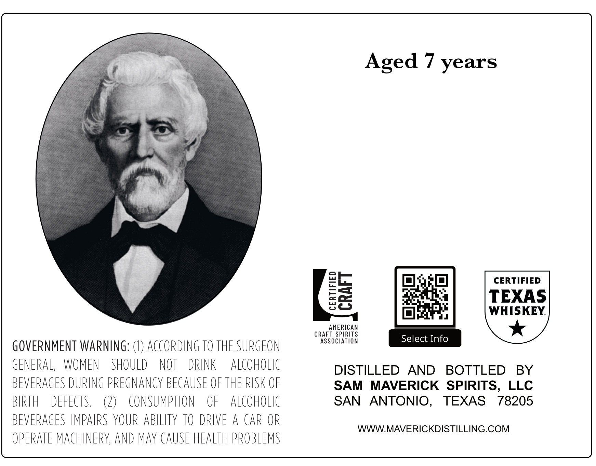
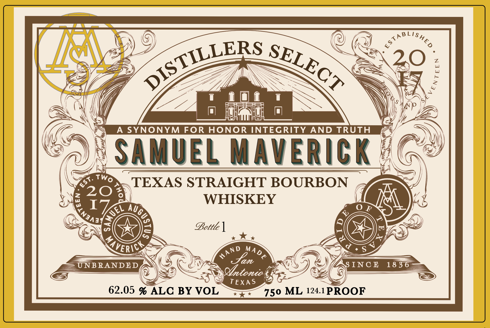

# TTB COLA Label Images - TTBID 26256001000068

**Brand Name:** SAMUEL MAVERICK

**Fanciful Name:** DISTILLERS SELECT

**Issue Date:** 09/16/2026

**Origin Code:** 44

**Product Class/Type:** 101

**Source:** [TTB Public COLA Registry](https://ttbonline.gov/colasonline/viewColaDetails.do?action=publicFormDisplay&ttbid=26256001000068)

## Label Images

### Back Label

### Front Label

## Extracted Label Text

*Text extracted via OCR - may contain errors*

**Detected Proof:** 124.1
**Detected Age:** 7 Years

### Back Label

Aged 7 years
CERTIFIED
03
TEXAS
WHISKEY
AMERiCAN
CRAFT SPIRITS
association
Select Info
GOVERNMENT WARNING: (€) ACCORDING TO THE SURGEON
GENERAL,
WOMEN
SHOULD
NOT
DRINK
alcoholic
DISTILLED
AND
BOTTLED
BY
BEVERAGES DURING PREGNANCY BECAUSE OF THE RISK OF
SAM
MAVERICK   SPIRITS,
LLC
BIRTH
DEFECTS.
L
consumption
OF
alCoHolIc
SAN
ANTONIO ,
TEXAS
78205
BEVERAGES IMPAIRS YOUR ABILITY TO DRIVE
A CAR OR
WWWMAVERICKDISTILLING.COM
OPERATE MAcHINERY, AND maY CAUSE HEALTH PROBLEMS

### Front Label

B
4
7S)
20
A
SYNONYM FOR
HONOR INTEGRITY
AND TRUTH
SAMUEL Maverick
0
A
TEXAS STRAIGHT BOURBON
20 ?
I
WHISKEY
0
F
~
2
E
OBottle 1
2
A
7 _
4
S
X
UNB RANDED
Jan
S INC @
18 3
Qtonio
TEXA $
62.05 % ALC BY VOL
750 ML 124.1PROOF
LishED
TA
DISTILLERS
SELECT
1
Two
St.
(
Auge
Ec
~
KAVERICY
AND
MADE
