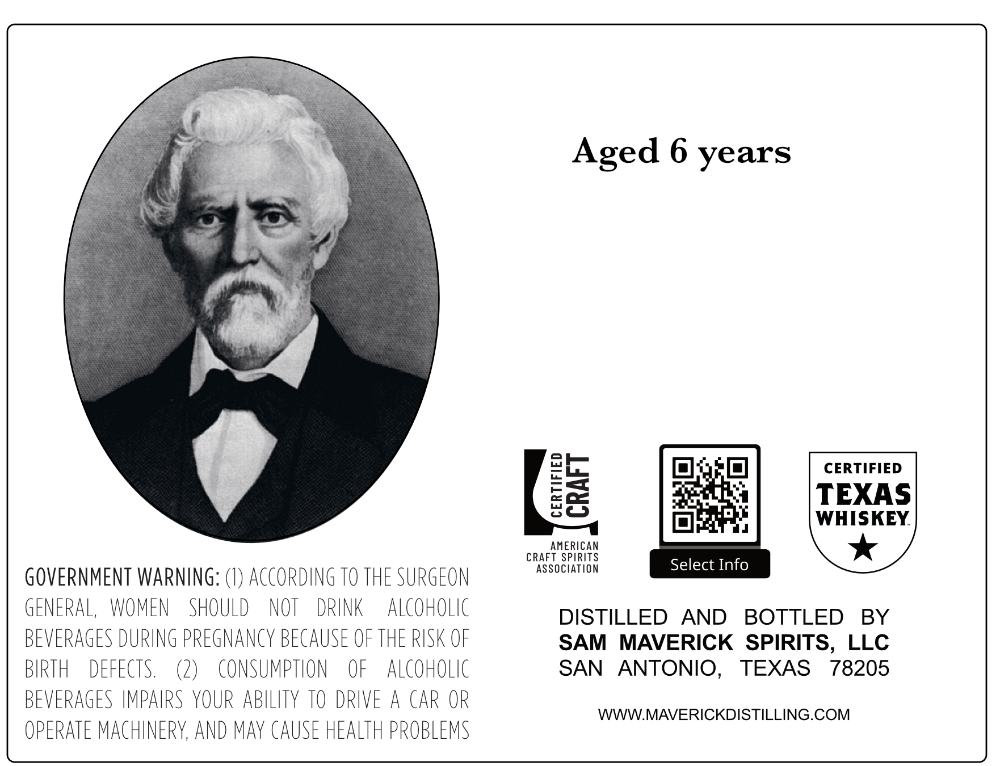
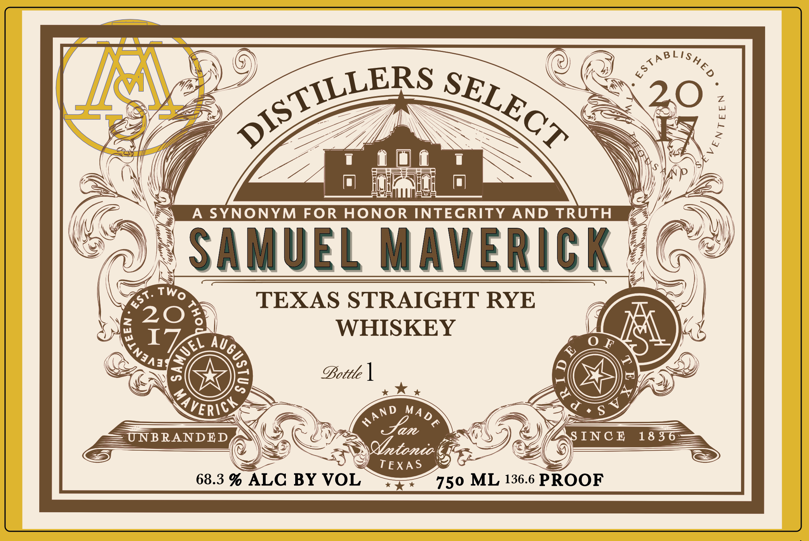

# TTB COLA Label Images - TTBID 26256001000069

**Brand Name:** SAMUEL MAVERICK

**Fanciful Name:** DISTILLERS SELECT

**Issue Date:** 09/16/2026

**Origin Code:** 44

**Product Class/Type:** 102

**Source:** [TTB Public COLA Registry](https://ttbonline.gov/colasonline/viewColaDetails.do?action=publicFormDisplay&ttbid=26256001000069)

## Label Images

### Back Label

### Front Label

## Extracted Label Text

*Text extracted via OCR - may contain errors*

**Detected Proof:** 136.6
**Detected Age:** 6 Years

### Back Label

Aged 6 years
CERTIFIED
8a
TEXAS
WHISKEY
AMERiCAN
CRAFT SPIRITS
association
Select Info
GOVERNMENT WARNING:
ACCORDING TO THE SURGEON
GENERAL,
WOMEN
SHOULD
NOT
DRINK
alcoholic
DISTILLED
AND
BOTTLED
BY
BEVERAGES DURING PREGNANcY BECAUSE OF THE RISK OF
SAM
MAVERICK   SPIRITS,
LLC
BIRTH
DEFECTS.
L)
consumption
OF
alCoHolIc
SAN
ANTONIO,
TEXAS
78205
BEVERAGES IMPAIRS YOUR ABILITY TO DRIVE
A CAR OR
WWWMAVERICKDISTILLING.COM
OPERATE MAcHINERY, AND maY CAUSE HEALTH PROBLEMS

### Front Label

<A
20
A SYNONYM FOR
HONOR INTEGRITY
AND TRUTH
SAMUEL Maverick
A
TEXAS STRAIGHT RYE
20
I
WHISKEY
0
6l_
F
X
72
@Bottle ]
PC
0
d
S
UNB RANDED
Jan
INC @
18 3
QYtonio
TEXA $
68.3 % ALC BY VOL
750 ML 136.6 PROOF
&LishEd
2
DISTILLERS
SELECT
1
Two
EST;
8
(
Auge
3
:
L
KAVERICY
mAND
MADE
