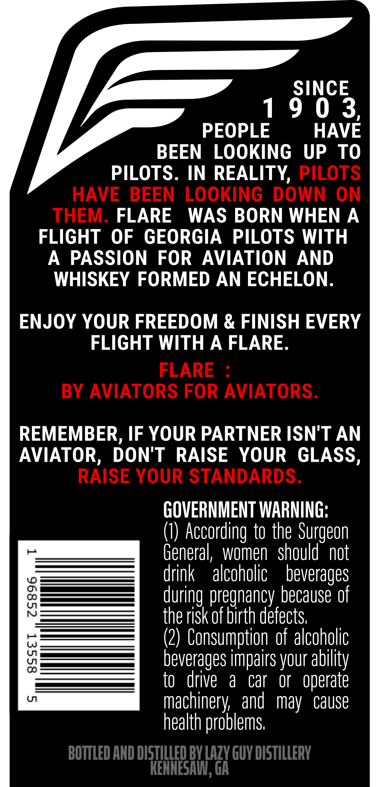
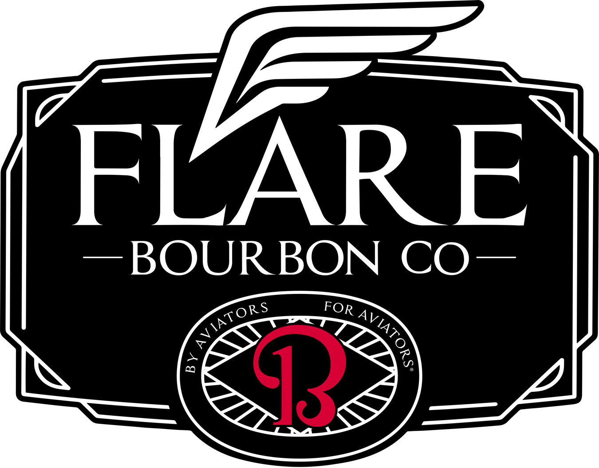
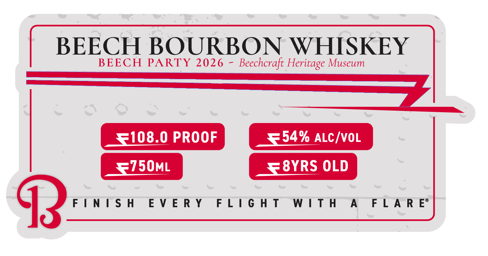

# TTB COLA Label Images - TTBID 26257001000042

**Brand Name:** BEECH

**Issue Date:** 09/21/2026

**Origin Code:** 08

**Product Class/Type:** 141

**Source:** [TTB Public COLA Registry](https://ttbonline.gov/colasonline/viewColaDetails.do?action=publicFormDisplay&ttbid=26257001000042)

## Label Images

### Back Label

### Front Label

### Label 2

### Label 4

## Extracted Label Text

*Text extracted via OCR - may contain errors*

*2 image(s) excluded: text did not meet readability threshold*

### Back Label

SINCE
1
9 0 3,
PEOPLE
HAVE
BEEN
LOOKING
UP
To
PILOTS.
IN REALITY, PILOTS
HAVE
BEEN
LOOKING
DOWN
ON
THEM:
FLARE
WAS BORN WHEN A
FLIGHT
OF
GEORGIA
PILOTS WITH
A
PASSION
FOR
AVIATION
AND
WHISKEY FORMED AN ECHELON
ENJOY YOUR FREEDOM & FINISH EVERY
FLIGHT WITH
A FLARE.
FLARE
BY AVIATORS FOR AVIATORS.
REMEMBER, IF YOUR PARTNER ISN'T AN
AVIATOR, DON'T
RAISE
YOUR GLASS,
RAISE YOUR STANDARDS.
GOVERNMENT WARNING;
(0) According to the Surgeon
General,
women   should^ not
drink
alcoholic
beverages
8
during pregnancy because of
the risk of birth defects;
(2) Consumption of alcoholic
8
beverages impairs your
to
drive
a
car
Or
operate
U
machinery;   and
may
cause
health problems;
BOTTLED AND DISTILLED BV LAZV GUY DISTILLERV
KENNESAI; Gh
ability

### Label 4

| BEECH BOURBON WHISKEY
BEECH PARTY 2026 - Beechcraft Heritage Museum
[i080 Poor ese acres
=3 fo

<P ane EVERY FLIGHT WITH A FLARE
