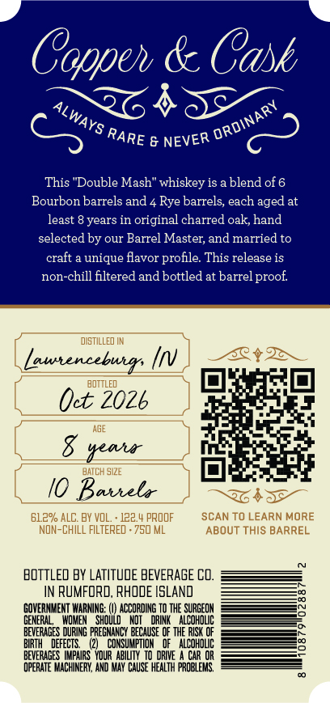
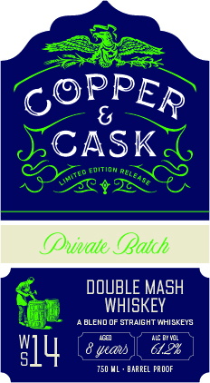

# TTB COLA Label Images - TTBID 26257001000049

**Brand Name:** COPPER & CASK

**Issue Date:** 09/22/2026

**Origin Code:** 40

**Product Class/Type:** 120

**Source:** [TTB Public COLA Registry](https://ttbonline.gov/colasonline/viewColaDetails.do?action=publicFormDisplay&ttbid=26257001000049)

## Label Images

### Back Label

### Front Label

### Label 2

## Extracted Label Text

*Text extracted via OCR - may contain errors*

**Detected Proof:** 122.4

### Back Label

Coppeh & Cask
4
This "Double Mash" whiskey is a blend of 6
Bourbon barrels and
Rye barrels; each aged at
least
years in original charred oak, hand
selected by our Barrel Master; and married to
craft
unique flavor profile This release is
non-chill filtered and bottled at barrel proof
disTILLeD IN
Lawtencebus
BOTTLED
Oet 20Zb
AGE
8
semua
HATCH SI2E
I0 Bavhela
61.2% ALC. BY VOL " 122.
PROF
SCAN TO LEARN MORE
NON-ChILL FILTERED . 750 ML
ABOUT THIS BARREL
boTTLeD BY LatItude BEVERAGE CO,
IN RUMFORD, RHODE IsLAND
GOVERNMENT WARMING;
ACCOROING To THE SURGEON
GEMERAL
WOMEN   ShoUld
DRINK   AlcohouC
BEVERAGES DURING PREGMARCY BECAUSE @F THE RISK €F
BIRTH
DEFECTS
CONSUMPTIOM
ALCohouc
BEVERAGES
IpAIRS   YOUR ABIVTY  TO @RIE
CAR OR
OPERATE MACHINERY, AND MAY CausE heaLTh PROBLEMAS,
ORDINARY
ALWAYS
RARE
NEVER

### Front Label

CASK
Famm
28'=
(uvate CBatch
DOuBLE MaSh
WHISKEY
alEMD
stpaightyhiskEYS
IWC Bal
4
Jcaus
6123
750 ML
BARPEL PR OOF
PPER
aeleatt
Iue 0

### Label 2

COPPER & CASK Say

MSW 8 WdddOd

a=
