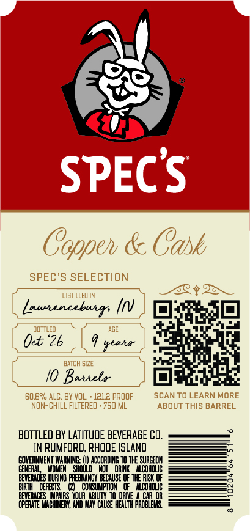
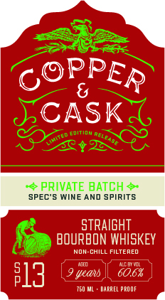

# TTB COLA Label Images - TTBID 26257001000058

**Brand Name:** COPPER & CASK

**Issue Date:** 09/18/2026

**Origin Code:** 40

**Product Class/Type:** 101

**Source:** [TTB Public COLA Registry](https://ttbonline.gov/colasonline/viewColaDetails.do?action=publicFormDisplay&ttbid=26257001000058)

## Label Images

### Back Label

### Front Label

### Label 2

## Extracted Label Text

*Text extracted via OCR - may contain errors*

**Detected Proof:** 121.2

### Back Label

SPECS
Coppeh & Cask
SPEC'S SELECTION
dIstILLED IN
Lautencebuir;
BOTTLED
Oet *2b
#eaia
BATCH SI2E
Baihela
60.6% ALC. BY VOL
1212 PROOF
SCAN TO LEARN MORE
NOn-ChILL FILTERED . 750 ML
ABOUT THIS BARREL
BOTTLeD BY LATITUDE BEVERAGE Co.
IN RUMFORD, RHODE ISLAnd
EONERMMEMNT WARNIG:
ACCORDING T0 THE SURGEOM
GENERN
E
DRINK
AlcoHouc
BEVERICES
BEEETECH EEcWC O HHERCTO
BIRTH
FFECTS
CONSUMPTION
acohouc
0oBRE Lnz Youa LiW
DRME
CaR OR
@FERHTE MICHEEY Ro vly Chuse HEALTH proaiEMs

### Front Label

CASK
2
4 PRIVATE BATCH <
SPEC'5 WINE AND SPIRITS
stRAIGHT
BOURBON WHISKEY
NON-CHILL FILTERED
4cb IdL
;
13
seau
60.6%
750 ML
BAPREL PROOF
PPER
oition ReLcade
Mitto =

### Label 2

COPPER & CASK Say

MSW 8 WdddOd

a=
