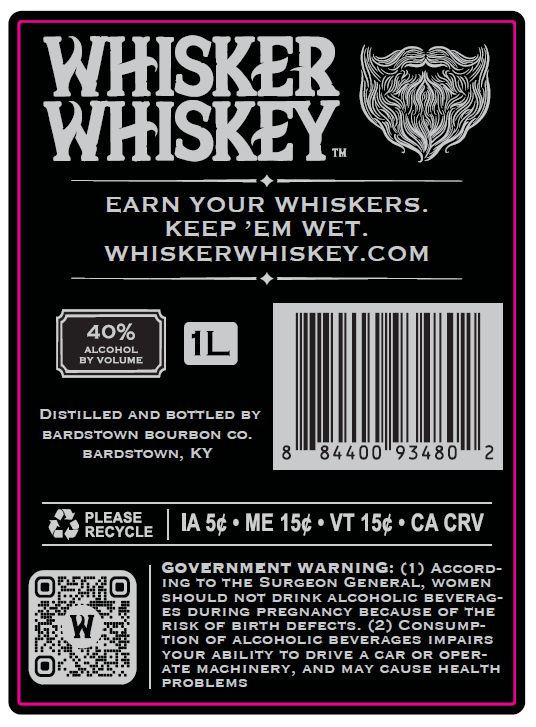
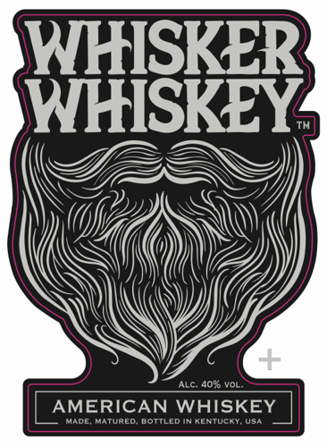

# TTB COLA Label Images - TTBID 26257001000070

**Brand Name:** WHISKER WHISKEY

**Issue Date:** 09/18/2026

**Origin Code:** 22

**Product Class/Type:** 140

**Source:** [TTB Public COLA Registry](https://ttbonline.gov/colasonline/viewColaDetails.do?action=publicFormDisplay&ttbid=26257001000070)

## Label Images

### Back Label

### Label 1

## Extracted Label Text

*Text extracted via OCR - may contain errors*

**Detected Proof:** 80

### Back Label

WHISKER
WHISKEY
EARN YOUR
WHISKERS_
KEEP 'EM
WET_
WHISKERWHISKEYCOM
40%
ALCOHOL
BY VOLUME
DISTILLED AND BOTTLED BY
BARDSTOWN BOURBON
Co.
BARDSTOWN, KY
84400"93480
RLEYGEE
IA 5c + ME 154 + VT 15c ' CA CRV
GOVERNMENT WARNING: (1) AcCoRD
ING To THE SURGEON GENERAL;
WOMEN
SHOULD NoT DRINK ALCOHOLIC BEVERAG-
E8 DURING PREGNANCY BECAUSE OF THE
W
RISK OF BIRTH DEFECTS. (2) CONSUMP-
TION OF ALCOHOLIC BEVERAGES IMPAIRS
YOUR ABILITY To
DRIVE A CAR OR
OPER-
ATE MACHINERY, AND
MAY CAUSE HEALTH
PROBLEMS

### Label 1

WHISKER
WHISKEY
ALC: 4090 VOl
AMERICAN
WHISKEY
Gem
Ianfd
He eeend
Enaedee
