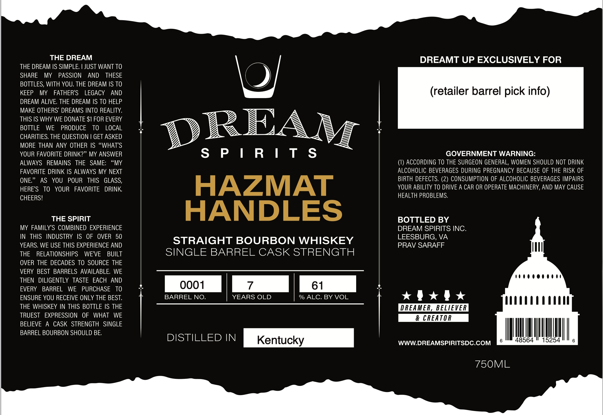

# TTB COLA Label Images - TTBID 26257001000077

**Brand Name:** DREAM SPIRITS

**Fanciful Name:** HAZMAT HANDLES

**Issue Date:** 09/22/2026

**Origin Code:** 05

**Product Class/Type:** 101

**Source:** [TTB Public COLA Registry](https://ttbonline.gov/colasonline/viewColaDetails.do?action=publicFormDisplay&ttbid=26257001000077)

## Label Images

### Label 1

## Extracted Label Text

*Text extracted via OCR - may contain errors*

### Label 1

THE DREAM
DREAMT UP EXCLUSIVELY FOR
THE DREAM IS SIMPLE: [JUST WANT TO
SHARE
MY
PASSION
AND
THESE
bol
BOTTLES; WITH YOU: THE DREAM IS TO
KEEP
MY
FATHER'S
LEGACY
AND
(retailer barrel pick info)
DREAM ALIVE; THE DREAM IS TO HELP
MAKE OTHERS' DREAMS INTO REALITY;
THIS IS WHY WE DONATE $1 FOR EVERY
BOTTLE
WE
PRODUCE
TO
LOCAL
DREAM
CHARITIES. THE QUESTION
GET ASKED
MORE THAN ANY OTHER IS "WHAT'S
YOUR FAVORITE DRINK?" MY ANSWER
S
P | R | T
S
GOVERNMENT WARNING:
ALWAYS
REMAINS
THE
SAME:
"MY
ACCORDING TO THE SURGEON GENERAL, WOMEN SHOULD NOT DRINK
FAVORITE DRINK IS ALWAYS MY NEXT
ALCOHOLIC BEVERAGES DURING PREGNANCY BECAUSE OF THE RISK OF
ONE_
AS
YOU
POUR
THIS
GLASS,
BIRTH DEFECTS: (2) CONSUMPTION OF ALCOHOLIC BEVERAGES IMPAIRS
HERES
TO
YOUR
FAVORITE
DRINK
HAZMAT
YOUR ABILITY TO DRIVE A CAR OR OPERATE MACHINERY, AND MAY CAUSE
CHEERS!
HEALTH PROBLEMS,
THE SPIRIT
HANDLES
BOTTLED BY
MY FAMILY'S COMBINED EXPERIENCE
DREAM SPIRITS INC
IN
THIS   INDUSTRY
IS
OF
OVER   50
LEESBURG
VA
YEARS. WE USE THIS EXPERIENCE AND
STRAIGHT BOURBON WHISKEY
PRAV SARAFF
THE
RELATIONSHIPS
WE'VE
BUILT
SINGLE BARREL CASK STRENGTH
OVER THE DECADES TO SOURCE THE
VERY BEST BARRELS AVAILABLE
WE
THEN
DILIGENTLY TASTE EACH
AND
EVERY
BARREL
WE
PURCHASE
TO
0001
61
ENSURE YOU RECEIVE ONLY THE BEST,
BARREL NO.
YEARS OLD
% ALC. BY VOL
THE WHISKEY IN THIS BOTTLE IS THE
DREAMER, BELIEVER
TRUEST
EXPRESSION
OF
WHAT
WE
& CREAT OR
BELIEVE
CASK STRENGTH SINGLE
BARREL BOURBON SHOULD BE
DISTILLED IN
Kentucky
WWWDREAMSPIRITSDC.COM
48564
5254
750ML
