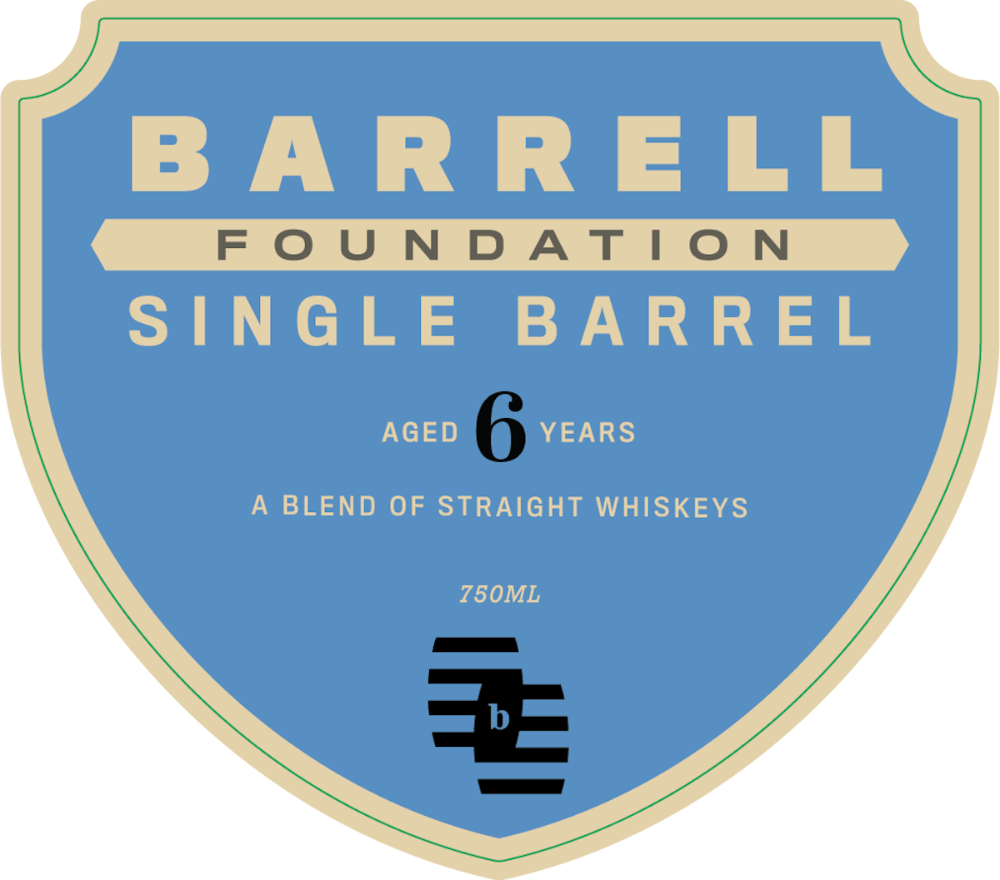
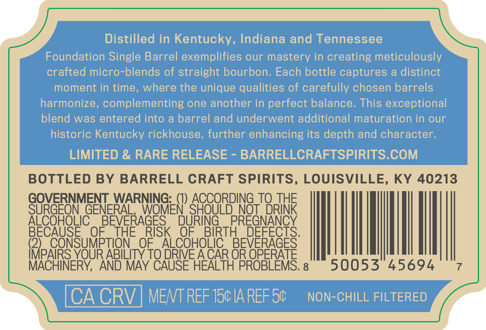
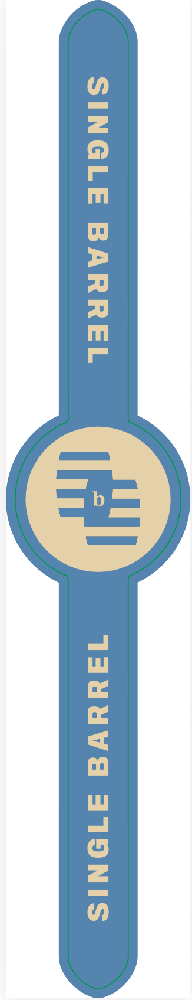

# TTB COLA Label Images - TTBID 26257001000160

**Brand Name:** BARRELL

**Issue Date:** 09/21/2026

**Origin Code:** 22

**Product Class/Type:** 120

**Source:** [TTB Public COLA Registry](https://ttbonline.gov/colasonline/viewColaDetails.do?action=publicFormDisplay&ttbid=26257001000160)

## Label Images

### Front Label

### Label 2

### Label 3

### Label 4

## Extracted Label Text

*Text extracted via OCR - may contain errors*

*2 image(s) excluded: text did not meet readability threshold*

### Label 2

Distilled in Kentucky, Indiana and Tennessee
Foundation Single Barrel exemplifies our mastery in creating meticulously
crafted micro-blends of straight bourbon: Each bottle captures a distinct
moment in time, where the unique qualities of carefully chosen barrels
harmonize, complementing one another in perfect balance. This exceptional
blend was entered into a barrel and underwent additional maturation in our
historic Kentucky rickhouse, further enhancing its depth and character.
LIMITED & RARE RELEASE
BARRELLCRAFTSPIRITS.COM
BOTTLED BY
BARRELL CRAFT SPIRITS, LOUISVILLE, KY 40213
GOVERNMENT WARNING: (1) ACCORDING TQ THE
SURGEON GENERAL
WOMEN' SHOULD NOT DRINK
ALCOHOLIC
BEVERAGES
DURING
PREGNANCY
BECAUSE
OF
THE
RISK
OF
BIRTH
DEFECTS.
(2)
CONSUMPTION
OF
ALCOHOLIC
BEVERAGES
IMPAIRS YOUR ABILITY TO DRIE ACAR OR OPERATE
MACHINERY,
AND MAY CAUSE HEALTH PROBLEMS. 8
50053
45694
CA CRV
MENT REF 150 IA REF 50
NON-CHILL FILTERED

### Label 4

SELECTED & BOTTLED FOR:
Sample Store
Il6.6
Sk.3%
024
Deoz
PROOF
ALC/VOL
RICK#
BARREL#
