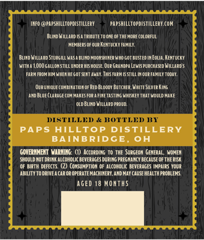
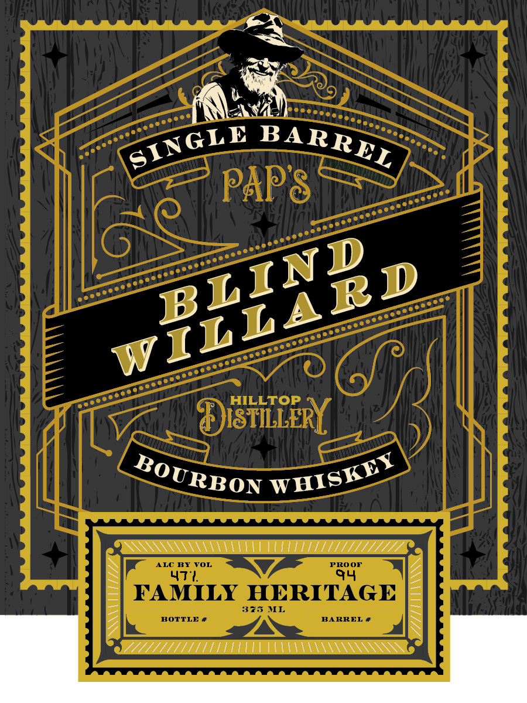

# TTB COLA Label Images - TTBID 26257001000168

**Brand Name:** PAP'S

**Issue Date:** 09/23/2026

**Origin Code:** 09

**Product Class/Type:** 141

**Source:** [TTB Public COLA Registry](https://ttbonline.gov/colasonline/viewColaDetails.do?action=publicFormDisplay&ttbid=26257001000168)

## Label Images

### Back Label

### Front Label

## Extracted Label Text

*Text extracted via OCR - may contain errors*

**Detected Proof:** 94

### Back Label

IFo @papshILLtopdIsTIlLery
papshilltopdistillery COM
BUnd WIllard [SA TRIEUTE TOONE C
THE MORE (OLORFUL
MENEERS OF ouR KeNtucky FAMILY:
Blihd Willard Sturgill MaSA ELIRD MOONSHIHER WHO GOT BUSTED IN Eolia,KentuckY
MITh
L,OOOGALLOM StILL UNDER HIS HOUSE. Que GRAMDPA LEWISPURCHASD Hillards
FARM FROE HIM WHERHE GOT SENT AWAY . ThIS FARM [S STilL Movp FAMILY Todar .
OuR UHIQUE COMEIHATIOM OF Red BLoody BuTcHER, WHite Silver King
ahd Blue (LARaGE coMIAKeSFor AFIETasTING WHISKEY That Mouldhike
oLd Blind WIlLard PROUD,
DSTILLED & ROTTLED FT
PAPS
HILLTOP DISTILLERY
BAINBRIDGE;
OH
GOVERHMEXTVARNING: (1) According TO THE SuRGEon GEMERAL,
WOMEN
shouLd Not DRIK aLcohOLIC BEVERAGES DURING PREGHANCY BECAUSE QF THE RISI
OF BIRTH DEFECTS   (2) (OMSUMPTION OF AlcohoLic BEVERAGES IMPAIRS YouR
ABILITY TO DRIVEA CAR OR OPERATE MACHINERY, AND MAY CAUSE HEALTH PROBLEMS
GED 18 MoATHS

### Front Label

PAP8
HILLTOP
JISTILLERY
ALC BY VOL
PROOF
47*
FAMILY HERITAGE
376
MI
BOTTLE #
BARREL
SINGLE
BARREL
BLIND
WILLARD
WHISKEY
BOURBON
94
