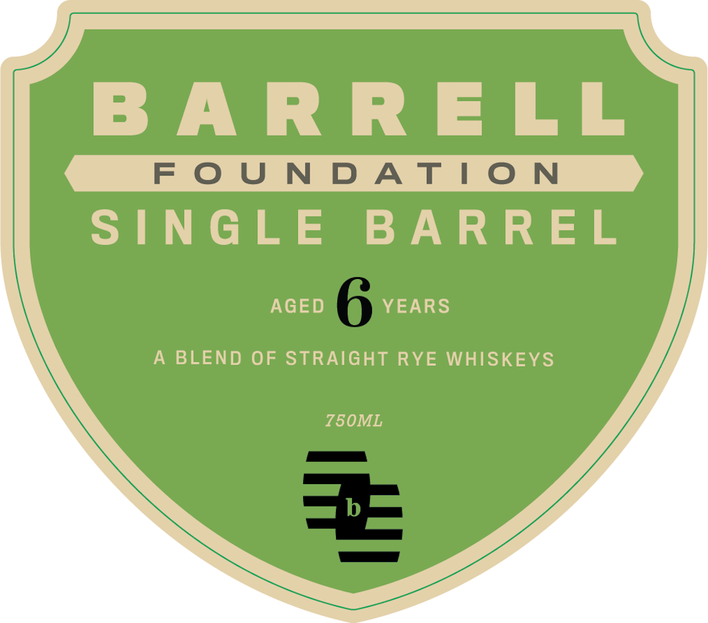
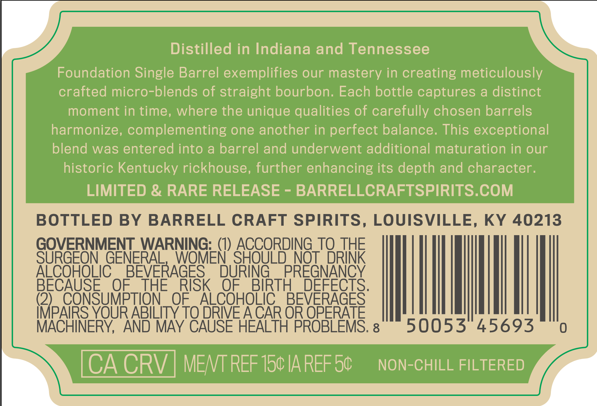
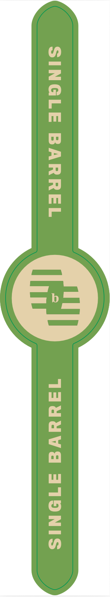
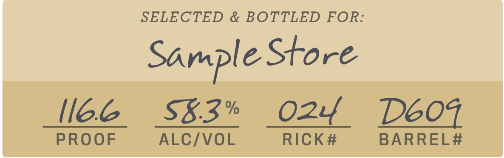

# TTB COLA Label Images - TTBID 26257001000170

**Brand Name:** BARRELL

**Issue Date:** 09/17/2026

**Origin Code:** 22

**Product Class/Type:** 122

**Source:** [TTB Public COLA Registry](https://ttbonline.gov/colasonline/viewColaDetails.do?action=publicFormDisplay&ttbid=26257001000170)

## Label Images

### Front Label

### Label 2

### Label 3

### Label 4

## Extracted Label Text

*Text extracted via OCR - may contain errors*

*1 image(s) excluded: text did not meet readability threshold*

### Front Label

BARRELL

SINGLE BARREL

AGED

YEARS

A BLEND OF STRAIGHT RYE WHISKEYS

Z50ML

### Label 2

Distilled in Indiana and Tennessee
Foundation Single Barrel exemplifies our mastery in creating meticulously
crafted micro-blends of straight bourbon: Each bottle captures & distinct
moment in time, where the unique qualities of carefully chosen barrels
harmonize, complementing one another in perfect balance. This exceptional
blend was entered into a barrel and underwent additional maturation in our
historic Kentucky rickhouse, further enhancing its depth and character.
LIMITED & RARE RELEASE
BARRELLCRAFTSPIRITS.COM
BOTTLED
BY
BARRELL CRAFT SPIRITS, LOUISVILLE, KY 40213
GOVERNMENT_WARNING:_(1) ACCORDING_TQ THE
SURGEON GENERAL
WQMEN' SHOULD NOT DRINK
ALCOHOLIC
BEVERAGES
DURING
PREGNANCY
BECAUSE
OF
THE
RISK
OF
BIRTH
DEFECTS.
(2)
CONSUMPTION
OF
ALCOHOLIC
BEVERAGES
IMPAIRS YOUR ABILITY TO DRIVE ACAR OR OPERATE
MACHINERY,
AND MAY CAUSE HEALTH PROBLEMS. 8
50053
45693
CA CRV
MENT REF 150 IAREF 50
NON-CHILL FILTERED

### Label 4

SELECTED & BOTTLED FOR:
Sample Store
Il6.6
Sk.3%
024
Deoz
PROOF
ALC/VOL
RICK#
BARREL#
