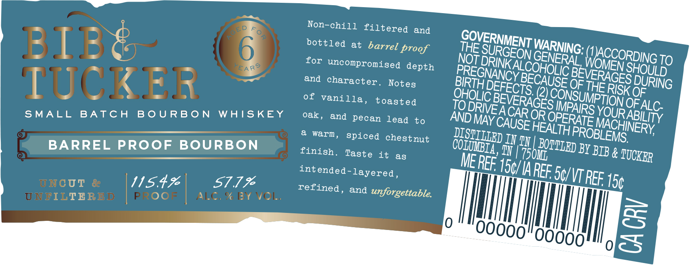

# TTB COLA Label Images - TTBID 26257001000266

**Brand Name:** BIB & TUCKER

**Fanciful Name:** BARREL PROOF BOURBON

**Issue Date:** 09/16/2026

**Origin Code:** 43

**Product Class/Type:** 141

**Source:** [TTB Public COLA Registry](https://ttbonline.gov/colasonline/viewColaDetails.do?action=publicFormDisplay&ttbid=26257001000266)

## Label Images

### Label 1

### Label 2

## Extracted Label Text

*Text extracted via OCR - may contain errors*

**Detected Age:** 6 Years

### Label 1

Non-chill filtered
and
BIB
0
bottled
at
barrel proof
THE
for uncompronised
NOT
TO
FEARS
depth
IUCKR
and character .
Notes
OF
of
vanilla ,
(2)
RISK OF
toasted
TO
OFALC
SMALL
BA T C H
B 0 U RB 0 N
WAISKEY
oak,
and
pecan Lead
MAFC
OR
to
warm ,
spiced chestnut
Il
BARREL
PROoF
BOURBON
finish_
Taste
it
#TUbo"
BY BIB &
a8
MEREF
int
ended-layered ,
REE 56/VT REF
ONCUr
82
115.49
57.79
refined ,
15c
UNFITB R BD
Proo=
'l6, '1` '(1 ,
and
unforgettable
6
8
PB ED
GOVERNMENT '
WARNING: _
SURGEON
MJOccoRDoG
GENERAL,
DRINKALCOHOLIC
SHOULD
PREGNANCY
BEVERAGES
BECAUSE
DURING
BIRTH
DEFECTS:
THE
OHOLIC
CONSUMPTION
BEVERAGES
IMPAIRS
DRIVE
YOURI
CARL
ABILITY
AND
OPERATE
CAUSE
MACHINERY;
HEALTH
PROBLEMS:
DISTITIED
BO@TIED
COLUIBIA ,
TUCKER
150/IA

### Label 2

VM
PROUDLY HADE IN
LIMITED REABABE
Tenne See
AGED
6
YEARS
Barrel Faaof
MI#d
