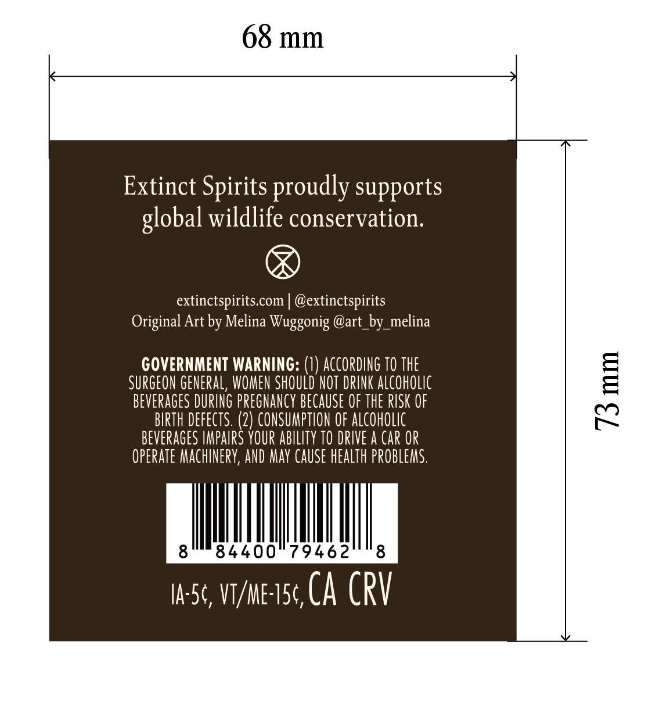
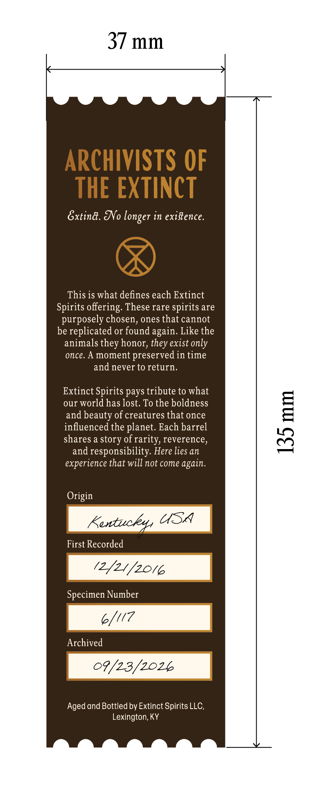
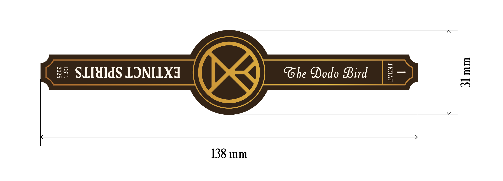

# TTB COLA Label Images - TTBID 26257001000289

**Brand Name:** EXTINCT SPIRITS

**Issue Date:** 09/16/2026

**Origin Code:** 22

**Product Class/Type:** 101

**Source:** [TTB Public COLA Registry](https://ttbonline.gov/colasonline/viewColaDetails.do?action=publicFormDisplay&ttbid=26257001000289)

## Label Images

### Front Label

### Label 3

### Label 4

## Extracted Label Text

*Text extracted via OCR - may contain errors*

### Front Label

68 mm
Extinct Spirits proudly supports
wildlife conservation:
extinctspiritscom
@extinctspirits
Original Art by Melina Wuggonig @art_by_melina
GOVERNMENT WARNING: (7) ACCORdINg TO THE
SURGEON GENEral, WOMEN SHOULD NOT DRINK aLcohOlIc
1
beverages DuRINg pregnancy bEcaUSe OF the RISK OF
birth defects: (2) CONSUMPTION OF ALcohOLIc
BEVERAGES IMPAIRS your ABILITy TO DRIVE a Car OR
operaTe Machinery, AND May CaUSe health pRObLemS.
8'
84400"79462
8
Ia-5c, VT/me I5c CA CRV
global

### Label 3

37 mm
ARCHIVISTS OF
THE EXTINCT
Gxtind. &No
in exiftence.
This is what defines each Extinct
Spirits offering: These rare spirits are
purposely chosen, ones that cannot
be replicated or found
Like the
animals
honor, they exist only
once_
A moment
preserved in time
and never to return
Extinct Spirits pays tribute to what
our world has lost. To the boldness
and beauty of creatures that once
influenced the planet. Each barrel
8
shares a
of rarity, reverence,
and responsibility. Here lies an
experience that will not come
Origin
Kentucky USA
First Recorded
(2/4/2016
Specimen Number
6/17
Archived
09/23/2026
Aged and Bottled by Extinct Spirits LLC
Lexington; KY
longer
again,
they
story
again.

### Label 4

tJ
8
U1
3
SLIHIdS LONILXI
Ghe Oodo Bird
E
1
138 mm
