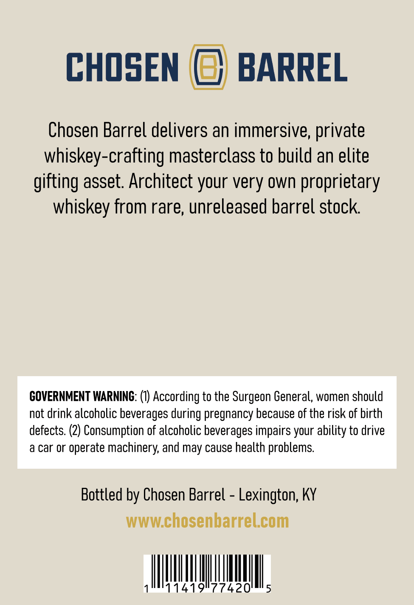
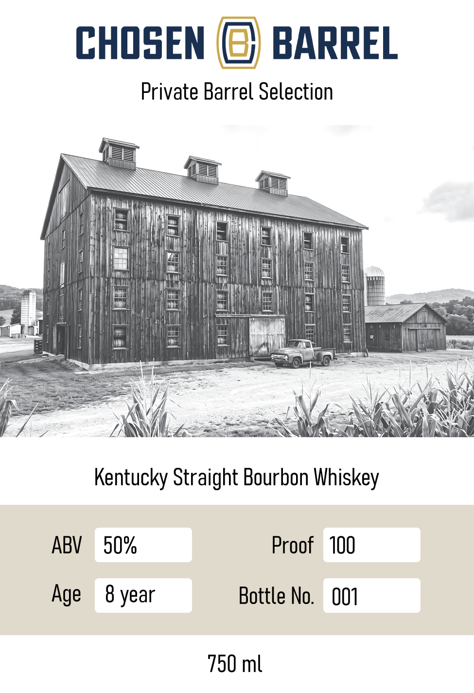

# TTB COLA Label Images - TTBID 26257001000297

**Brand Name:** CHOSEN BARREL

**Issue Date:** 09/18/2026

**Origin Code:** 22

**Product Class/Type:** 101

**Source:** [TTB Public COLA Registry](https://ttbonline.gov/colasonline/viewColaDetails.do?action=publicFormDisplay&ttbid=26257001000297)

## Label Images

### Back Label

### Front Label

## Extracted Label Text

*Text extracted via OCR - may contain errors*

**Detected Proof:** 100
**Detected Age:** 8 Years

### Back Label

CHOSEN
BARREL
Chosen Barrel delivers an immersive,
whiskey-crafting masterclass to build an elite
gifting asset. Architect your very own proprietary
whiskey from rare; unreleased barrel stock
GOVERNMENT WARNING: (0) According to the Surgeon General, women should
not drink alcoholic beverages during pregnancy because of the risk of birth
defects: (2) Consumption of alcoholic beverages impairs your ability to drive
a car Or
operate machinery; and
cause health problems
Bottled by Chosen Barrel
Lexington; KY
WWWchosenbarrelcom
1419"77420'
private
may

### Front Label

CHOSEN (G) BARREL
Private Barrel Selection
Men a ae ore
there PMT
(IE hn Ss
Kentucky Straight Bourbon Whiskey
ABV 50% Proof 100
Age 8 year Bottle No. 001
750 ml
