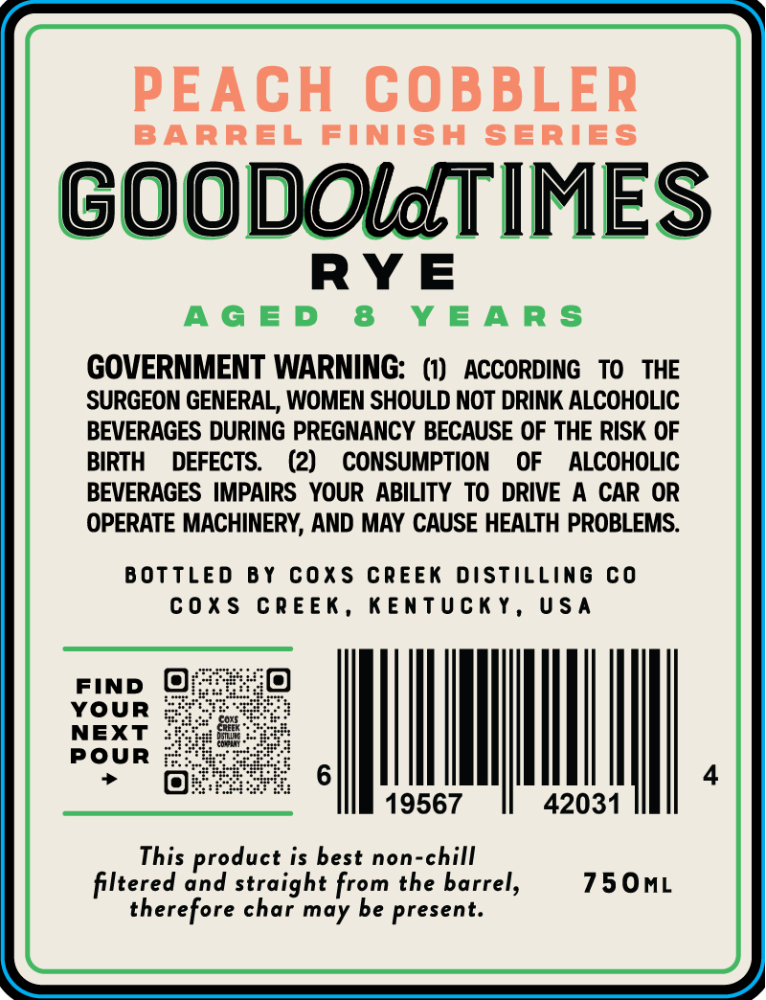
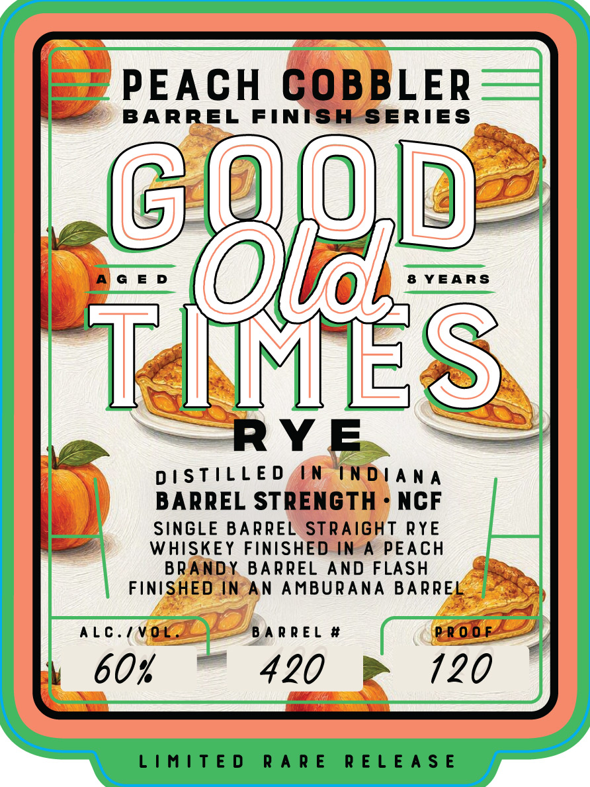

# TTB COLA Label Images - TTBID 26257001000304

**Brand Name:** GOOD OLD TIMES

**Fanciful Name:** PEACH COBBLER RYE

**Issue Date:** 10/05/2026

**Origin Code:** 22

**Product Class/Type:** 102

**Source:** [TTB Public COLA Registry](https://ttbonline.gov/colasonline/viewColaDetails.do?action=publicFormDisplay&ttbid=26257001000304)

## Label Images

### Back Label

### Front Label

## Extracted Label Text

*Text extracted via OCR - may contain errors*

**Detected Proof:** 120
**Detected Age:** 8 Years

### Back Label

PEACH COBBLER

BARREL FINISH SERIES

GOODOMTIMES

RYE

AGED 8 YEARS

GOVERNMENT WARNING: (1) ACCORDING TO THE

SURGEON GENERAL, WOMEN SHOULD NOT DRINK ALCOHOLIC

BEVERAGES DURING PREGNANCY BECAUSE OF THE RISK OF

BIRTH DEFECTS. (2) CONSUMPTION OF ALCOHOLIC

BEVERAGES IMPAIRS YOUR ABILITY TO DRIVE A CAR OR

OPERATE MACHINERY, AND MAY CAUSE HEALTH PROBLEMS.

BOTTLED BY COXS CREEK DISTILLING CO

COXS CREEK, KENTUCKY, USA

FIND @

YOUR

NEXT

POUR

NMI.

J

19567

42031

This product is best non-chill

750mL

filtered and straight from the barrel,

therefore char may be present.

### Front Label

PEACH GOBBLER

BARREL FINISH SERIES

“ol

8)

yo

AGED

8 YEARS

Min

—

RYE.

DISTILLED AN INDIANA

BARREL STRENGTH - NCF

SINGLE BARREL STRAIGHT RYE

WHISKEY FINISHED IN A PEACH

BRANDY BARREL AND FLASH

FINISHED IN-AN AMBURANA BARREL

ALC./V OL

‘BARREL #

PROOF

60%

420 ep 120
