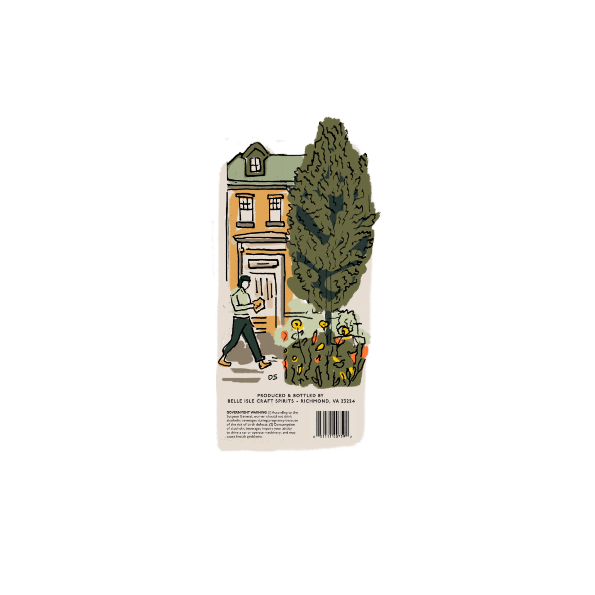
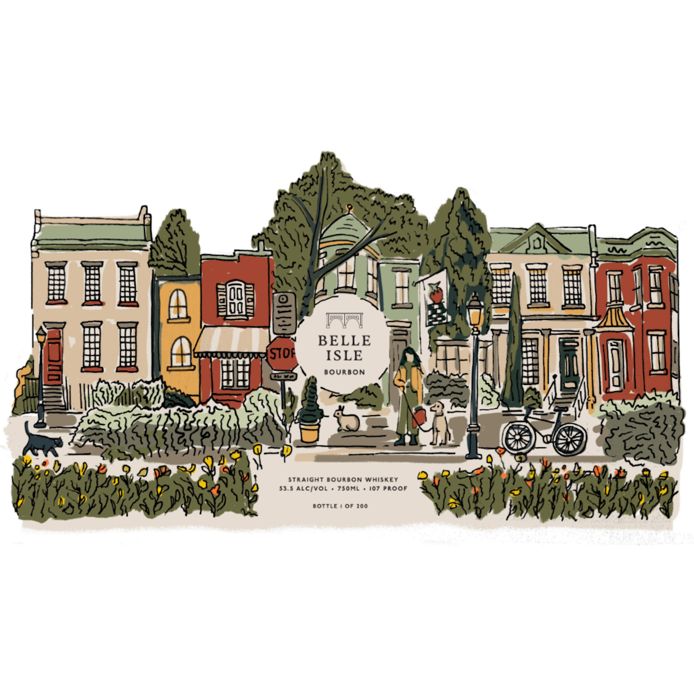

# TTB COLA Label Images - TTBID 26257001000366

**Brand Name:** BELLE ISLE

**Fanciful Name:** BOURBON

**Issue Date:** 09/16/2026

**Origin Code:** 05

**Product Class/Type:** 101

**Source:** [TTB Public COLA Registry](https://ttbonline.gov/colasonline/viewColaDetails.do?action=publicFormDisplay&ttbid=26257001000366)

## Label Images

### Back Label

### Front Label

## Extracted Label Text

*Text extracted via OCR - may contain errors*

**Detected Proof:** 107

### Back Label

BOTTLED BY

BELLE ISLE CRAFT S! ‘S + RICHMOND, VA 23224

GOVERNMENT WARNING. (1) According to the
‘Surgeon General, women should not érink
alcoholic beverages during pregrancy becaute
‘of the risk of birth defects. 2} Consumption
° 2

Cf alcoholic beverages impairs your ability
‘to drive a car or operate machinery, and may
‘couse health problems,

### Front Label

4
BELLE
STOF
ISLE
BOURBON
StrAight Bourbon Whisket
Alcivo
ZS0L
107 Proof
Bottle
OF 200
