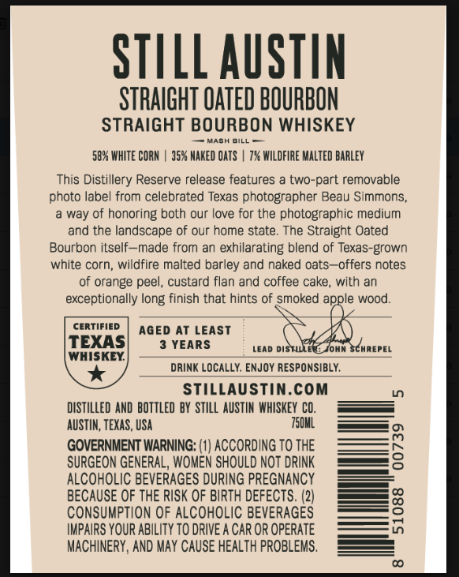
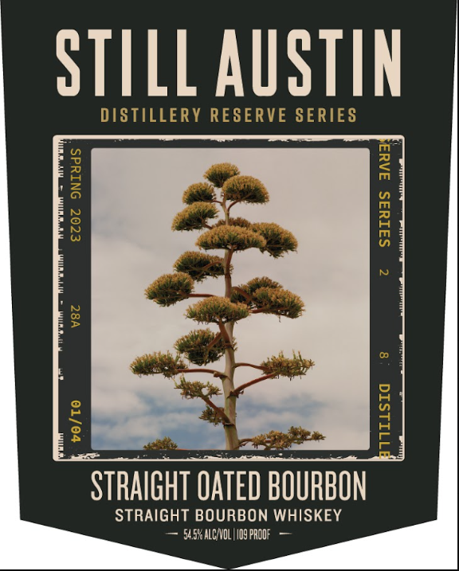
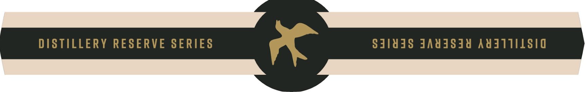

# TTB COLA Label Images - TTBID 26257001000400

**Brand Name:** STILL AUSTIN

**Fanciful Name:** DISTILLERY RESERVE SERIES STRAIGHT OATED BOURBON

**Issue Date:** 09/24/2026

**Origin Code:** 44

**Product Class/Type:** 101

**Source:** [TTB Public COLA Registry](https://ttbonline.gov/colasonline/viewColaDetails.do?action=publicFormDisplay&ttbid=26257001000400)

## Label Images

### Back Label

### Front Label

### Label 3

## Extracted Label Text

*Text extracted via OCR - may contain errors*

**Detected Age:** 3 Years

### Back Label

STILL AUSTIN
STRAIGHT OATED BOURBON
STRAIGHT BOURBON WHISKEY
HASH
BILL
5884 WhITE CORN
35% MAKED QatS
7% WILDFIRE MaLTed barleY
This Distillery Reserve release features a two-part removable
photo label from celebrated Texas photographer Beau Simmons
way of honoring both our love for the photographic medium
and the landscape of our home state. The Straight Oated
Bourbon itself
made from an
exhilarating blend of Texas-grown
white corn, wildfire malted barley and naked oats-offers notes
of orange peel, custard flan and coffee cake,
with an
exceptionally long finish that hints of smoked apple wood.
CERTIFIED
AGED AT LEAST
TEXAS
3 YEARS
LEAd DISTILLERE
Ohw SchRepEL
WHISKEY
DRINK LOCALLY; ENJOY RESPONSIBLY:
Stillaustin.com
distIlled AND bottled BY  STILL AUSTIN  WHISKEY CO.
AUSTIN, TEXAS , USA
750uL
GOVERNMENT WARNING: (1| AcCORdInG To THE
8
SURGEON GENERAL, WOMEN SHOULD NOT DRINK
ALCOHOLIC BEVERAGES DURING PREGNANCY
BECAUSE OF THE RISK OF BIRTH DEFECTS.
Consumption OF ALCOHOLiC BEVERAGES
2
IMPAIRS YOUR ABILITY TO DRIVE A CAR OR OPERATE
MACHINERY, AND May CAUSE HEALTH PROBLEMS .

### Front Label

STILL AUSTIN

STRAIGHT TNTED BOURBON

Ss REL eee USISKEY

### Label 3

DISTILLERY RESERVE SERIES

SIlYdS JAWISIY AYATIILSIG
