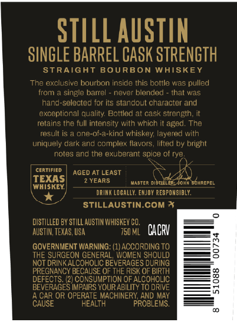
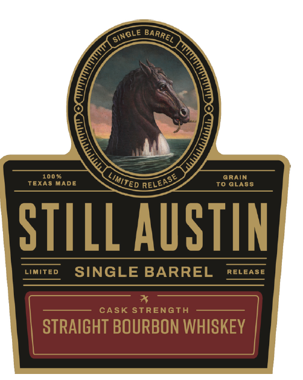
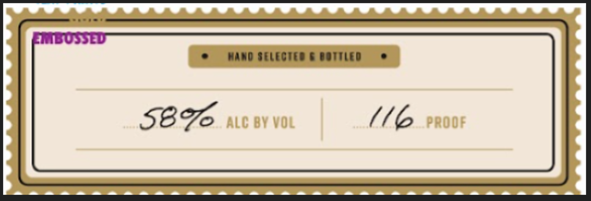

# TTB COLA Label Images - TTBID 26257001000456

**Brand Name:** STILL AUSTIN

**Fanciful Name:** SINGLE BARREL PROGRAM BOURBON

**Issue Date:** 09/18/2026

**Origin Code:** 44

**Product Class/Type:** 101

**Source:** [TTB Public COLA Registry](https://ttbonline.gov/colasonline/viewColaDetails.do?action=publicFormDisplay&ttbid=26257001000456)

## Label Images

### Back Label

### Front Label

### Label 3

### Label 4

## Extracted Label Text

*Text extracted via OCR - may contain errors*

### Back Label

STILL AUSTIN
SINGLE BARREL CASK STRENGTH
STRAIGHT
BOURBON WAISKEY
The exclusive bourbon inside this bottle was pulled
iram
single barrel
nevei
blended
thal was
hand-selected for its standout character and
axcoptional quality Bottled at cask strangth;
retains tha full intensity with which it aged; The
result I5
one-of-a-kind whiskey layered with
uniquely dark and complex flavors
lifted by bright
notes and the exuberant spice of rye
certified
AGED AT LEAST
TEXAS
YEARS
MasteR disuller Johm SCHREPEL
WHISKEY
DRINK Locally: EmJOY RESPOMSIBLY.
STILLAUSTIN.COM *
DISTILLED BY STILL AUSTIN WHISKEY CO,
AUSTIN, TEXAS, USA
750 ML   CACRV
GOVERNMENT WARNING=
(1ACCORDING TO
THE SURGEON GENERAL, WOMEN SHOULD
NOT DRINK ALCOHOLIC BEVERAGES DURING
PREGNANCY BECAUSE OF THE RISK OF BIRTH
DEFECTS: (2) CONSUMPTION OF ALCOHOLIC
3
BEVERAGES IMPAIRS YOUR ABILITY TO DRIVE
CAUSE
CAR OR OPERATE MACHINERY AND MAY
HEALTH
PROBLEMS;
8

### Front Label

100 %
Grain
TExAS MADE
To GLASS
STILL AUSTIN
LImITEd
SINGLE BARREL
RELEASE
CASK STREnGTH
STRAIGHT BOURBON WHISKEY
"SInGLe
BARREL
Limited
RELEASE

### Label 3

ERBOSSED
Haad IELECIEd
bu(Ed
587
AlC BV VOL
PROOF

### Label 4

SINGLE BARREL CASK STRENGTH

HLONIULS WSVO 197uNVE ITINIS

x
