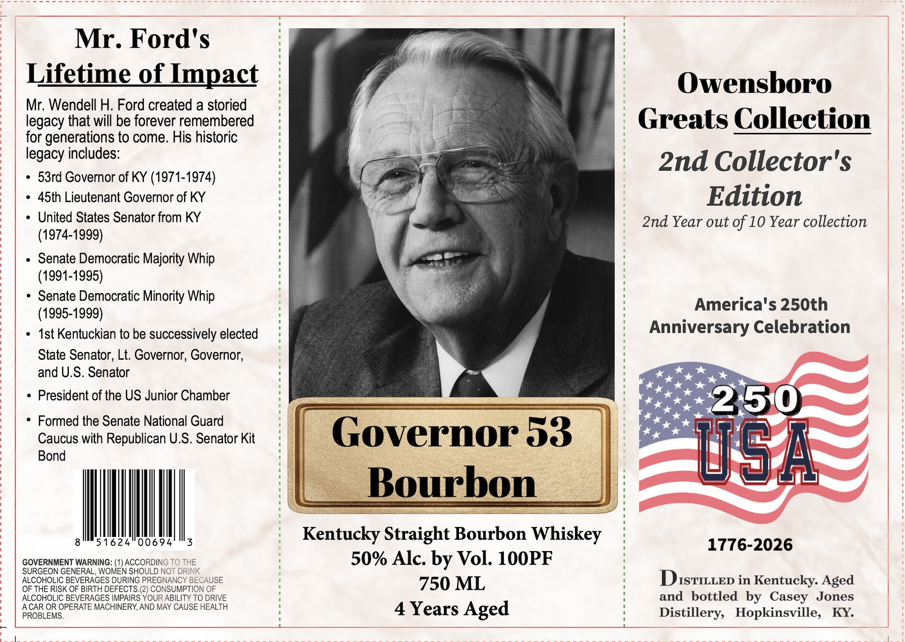

# TTB COLA Label Images - TTBID 26257001000465

**Brand Name:** GOVERNOR 53 BOURBON

**Issue Date:** 09/16/2026

**Origin Code:** 22

**Product Class/Type:** 101

**Source:** [TTB Public COLA Registry](https://ttbonline.gov/colasonline/viewColaDetails.do?action=publicFormDisplay&ttbid=26257001000465)

## Label Images

### Label 1

## Extracted Label Text

*Text extracted via OCR - may contain errors*

**Detected Proof:** 100
**Detected Age:** 10 Years

### Label 1

Mr. Ford's
Lifetime of Impact
Owensboro
Mr. Wendell H: Ford created a storied
legacy that will be forever remembered
Greats Collection
for generations to come. His historic
legacy includes:
2nd Collector'$
53rd Governor of KY (1971-1974)
45th Lieutenant Governor of KY
Edition
United States Senator from KY
2nd Year out of 10 Year collection
(1974-1999)
Senate Democratic Majority Whip
(1991-1995)
Senate Democratic Minority Whip
America's 250th
(1995-1999)
Ist Kentuckian to be successively elected
Anniversary Celebration
State Senator, Lt: Governor; Governor;
and U.S. Senator
President of the US Junior Chamber
250
Formed the Senate National Guard
Caucus with Republican U.S. Senator Kit
Governor 53
Bond
05;
Bourbon
51624
00694
Kentucky Straight Bourbon Whiskey
1776-2026
GOVERNMENT WARNING: (1) ACCORDING TO THE
50% Alc. by Vol: 1OOPF
SURGEON GENERAL WOMEN SHOULD NOT DRINK
ALCOHOLIC BEVERAGES DURING PREGNANCY BECAUSE
750 ML
DISTILLED in Kentucky. Aged
OF THE RISK OF BIRTH DEFECTS: (2) CONSUMPTION OF
ALCOHOLIC BEVERAGES IMPAIRS YOUR ABILITY TO DRIVE
and
bottled by Casey
Jones
A CAR OR OPERATE MACHINERY AND MAY CAUSE HEALTH
4
Years Aged
Distillery,
Hopkinsville,
KY:
PROBLEMS.
