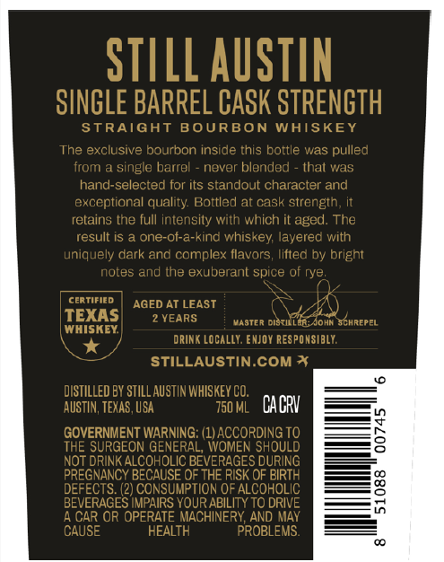
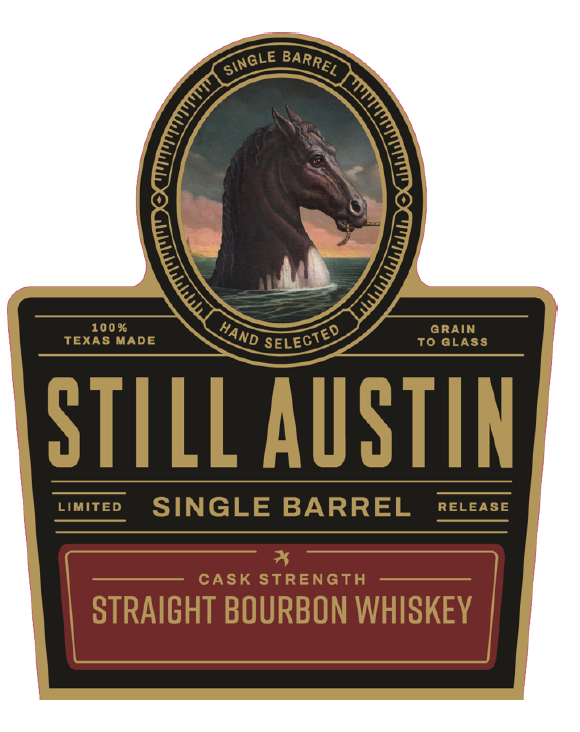

# TTB COLA Label Images - TTBID 26257001000469

**Brand Name:** STILL AUSTIN

**Fanciful Name:** SINGLE BARREL BOURBON PROGRAM

**Issue Date:** 09/23/2026

**Origin Code:** 44

**Product Class/Type:** 101

**Source:** [TTB Public COLA Registry](https://ttbonline.gov/colasonline/viewColaDetails.do?action=publicFormDisplay&ttbid=26257001000469)

## Label Images

### Back Label

### Front Label

### Label 2

### Label 4

## Extracted Label Text

*Text extracted via OCR - may contain errors*

### Back Label

STILL AUSTIN
SINGLE BARREL CASK STRENGTH
STRAIGHT
BOURBON
WAISKEY
The exclusive bourbon inside this bottle was pulled
from
single barrel
never blended
thalt was
hand-selected for its standout character and
exceptional quality Bottled at cask strength
relains the full intensily with which it aged. The
result iS
one-of-a-kind whiskey; layered with
uniquely dark and complex flavors
lifted by bright
notes and the exuberant spice of rye
certified
AGED AT LEAST
TEXAS
VEARS
Vaster Distillia;Johh Schrepel
WHISKEY
DRINK LoCaLLY: ENJOY RES PO NSIBLY:
STILLAUSTIN.COM *
DISTILLED BY STILL AUSTIN WHISKEY CO;
AUSTIN, TEXAS , USA
750 ML
CACRV
GOVERNMENT WARNING: (1)ACCORDING
DHNut8
2
THE SURGEON GENERAL, WOMEN
NOT DRINK ALCOHOLIC BEVERAGES DURING
PREGNANCY BECAUSE OF THE RISK OF BIRTH
DEFECTS: (2) CONSUMPTION OF ALCOHOLIC
3
BEVERAGES IMPAIRS YOUR ABILITY TO DRIVE
CAR OR OPERATE MACHINERY; AND MAY
CAUSE
HEALTH
PROBLEMS.

### Front Label

100 %
GRAIN
TEXAS MADE
To GLASS
STILL ASTIN
LIMIted
SINGLE BARREL
RELEASE
CASK StREnGTH
STRAIGHT BOURBON WHISKEY
~SinGLe
~BARREL
HAND
SELECTED

### Label 2

TOTAL WINE & MORE
BaRREL MUMBEE
ABWIVOL
Proof
BaRael dumpEd
22050910
66;
720
11 /25[202,

### Label 4

SINGLE BARREL CASK STRENGTH

HLONIULS WSVO 197uNVE ITINIS

x
