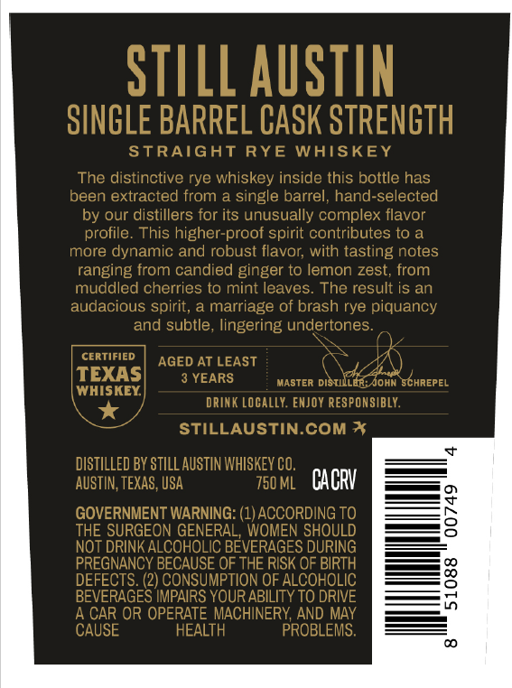
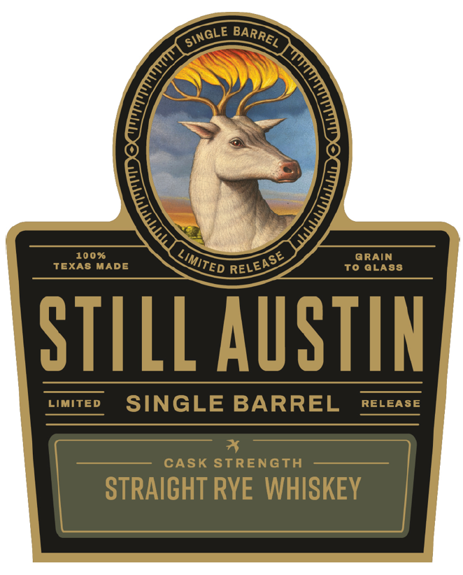

# TTB COLA Label Images - TTBID 26257001000480

**Brand Name:** STILL AUSTIN

**Fanciful Name:** SINGLE BARREL PROGRAM RYE

**Issue Date:** 09/23/2026

**Origin Code:** 44

**Product Class/Type:** 102

**Source:** [TTB Public COLA Registry](https://ttbonline.gov/colasonline/viewColaDetails.do?action=publicFormDisplay&ttbid=26257001000480)

## Label Images

### Back Label

### Front Label

### Label 2

### Label 4

## Extracted Label Text

*Text extracted via OCR - may contain errors*

**Detected Age:** 3 Years

### Back Label

STILL AUSTIN
SINGLE BARPEL CASK STRENGTH
STRAIGHT RYE WHISKEY
The distinctive rye whiskey inside this bottle has
been extracted from a single barrel, hand-selected
by our distillers for its unusually complex flavor
profile: This higher-proof spirit contributes to a
more dynamic and robust flavor; with tasting notes
ranging from candied ginger to lemon zest; from
muddled cherries to mint leaves
The result is an
audacious spirit, a marriage of brash rye piquancy
and subtle, lingering undertones:
CERTIFIED
AGED AT LEAST
TEXAS
3 YEARS
MaSTERdistiLer;John Schrepel
WHISKEY
DRINK Locally. ENJOY RESPONSIBLY
STILLAUSTIN.COM %
DISTILLED BY STILL AUSTIN WHISKEY CO.
AUSTIN; TEXAS, USA
750 ML
CACRV
GOVERNMENT WARNING: (1) ACCORDING TO
2
THE SURGEON GENERAL, WOMEN SHOULD
NOT DRINK ALCOHOLIC BEVERAGES DURING
PREGNANCY BECAUSE OF THE RISK OF BIRTH
DEFECTS: (2) CONSUMPTION OF ALCOHOLIC
3
BEVERAGES IMPAIRS YOUR ABILITY TO DRIVE
A CAR OR OPERATE MACHINERY AND MAY
CAUSE
HEALTH
PROBLEMS:

### Front Label

100 %
@RAIN
TEXAS MADE
To GLA88
STILL AUSTIN
Limited
SINGLE BARREL
RELEASE
CASK STRENGTH
STRAICHT RYE WHISKEY
SINGLE
BARREL
1
LIMITED
RELEASE

### Label 2

ERBOSSED
Haad IELECIEd
bu(Ed
587
AlC BV VOL
PROOF

### Label 4

SINGLE BARREL CASK STRENGTH

HLONIULS WSVO 197uNVE ITINIS

x
