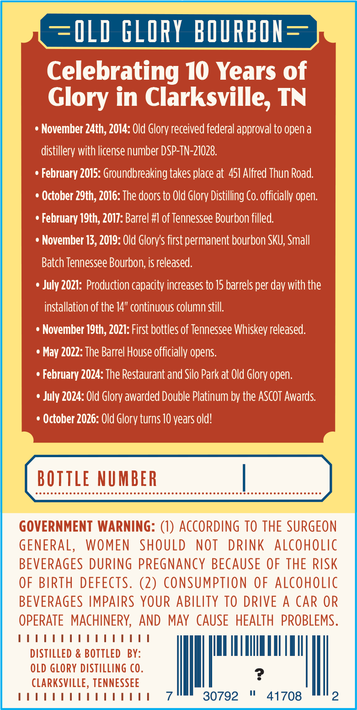
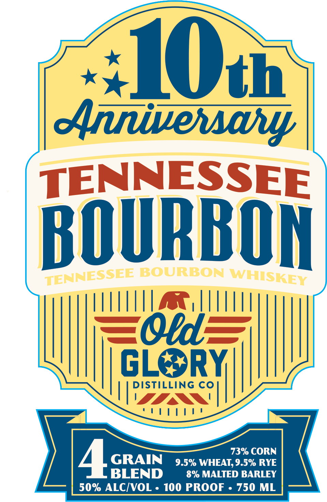

# TTB COLA Label Images - TTBID 26257001000491

**Brand Name:** TENNESSEE BOURBON

**Issue Date:** 09/16/2026

**Origin Code:** 43

**Product Class/Type:** 141

**Source:** [TTB Public COLA Registry](https://ttbonline.gov/colasonline/viewColaDetails.do?action=publicFormDisplay&ttbid=26257001000491)

## Label Images

### Back Label

### Front Label

## Extracted Label Text

*Text extracted via OCR - may contain errors*

**Detected Proof:** 100
**Detected Age:** 10 Years

### Back Label

OLD GLORY BORBON =
Celebrating 10 Years of
Glory in Clarksville, TN
November 24th, 2014: Old Glory received federal approval to open a
distillery with license number DSP-TN-21028.
February 2015: Groundbreaking takes place at  451 Alfred Thun Road:
October 29th, 2016: The doors to Old Glory Distilling Co.officially open.
February I9th, 2017: Barrel #I of Tennessee Bourbon filled
November 13,2019: Old Glory s first permanent bourbon SKU; Small
Batch Tennessee Bourbon; is released:
July 2021: Production capacity increases to 15 barrels per
with the
installation of the 14" continuous column still:
November I9th, 2021: First bottles of Tennessee Whiskey released.
May 2022: The Barrel House officially opens:
February 2024: The Restaurant and Silo Park at Old Glory open.
July 2024: Old Glory awarded Double Platinum by the AScOT Awards
October 2026: Old Glory turns 10 years old!
BOtTLe NUMBER
GOVERNMENT WARNING: (1) ACCORDING To THE SURGEON
GENERAL,
WOMEN
SHOULD
NOT
DRINK
ALCoholic
BEVERAGES DURING PREGNANCY BECAUSE OF THE RiSk
OF BIRTH DEFECTS. (2) consumption
OF ALcoholic
BEVERAGES IMPAIRS YOUR ABILITY TO DRIVE
A
CAR OR
OPERATE  MAChINERY,
AND MAY CAUSE HEALTH PROBLEMS.
DISTILLED & BOTTLED
BY:
OLD GLORY DISTILLIng Co.
CLARkSVILLE, TENNESSEE
30792
41708
2
day

### Front Label

IOtn
dtnnvewavy
TENNESSEE
ROURBON
TENNESSEE BOURBON WMHISKEY
EOrd
GL
RY
DISTILLING CO
73% CORN
4L
GRAIN
9.5% WHEAT; 9.5% RYE
BLEND
8% MALTED BARLEY
50% ALCIVOL . 100 PROOF
750 ML
