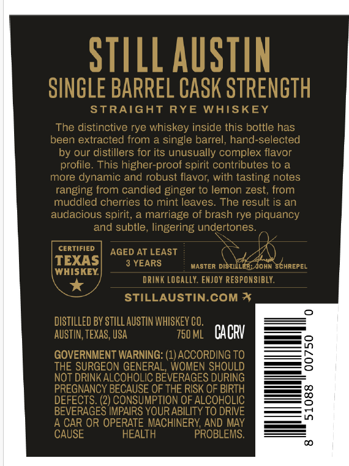
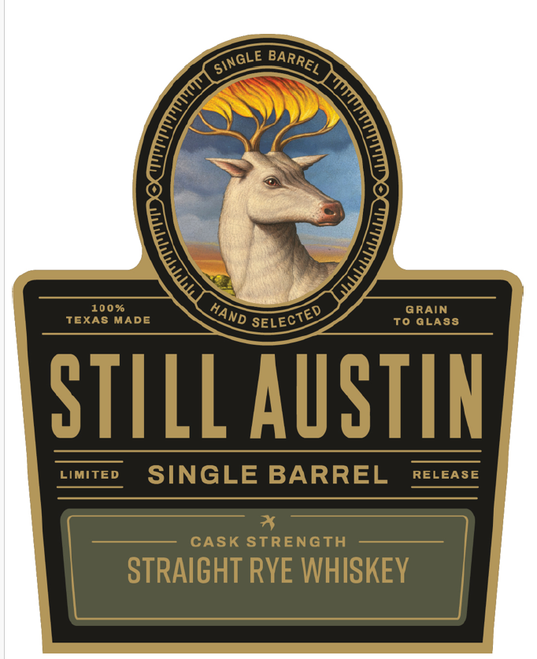
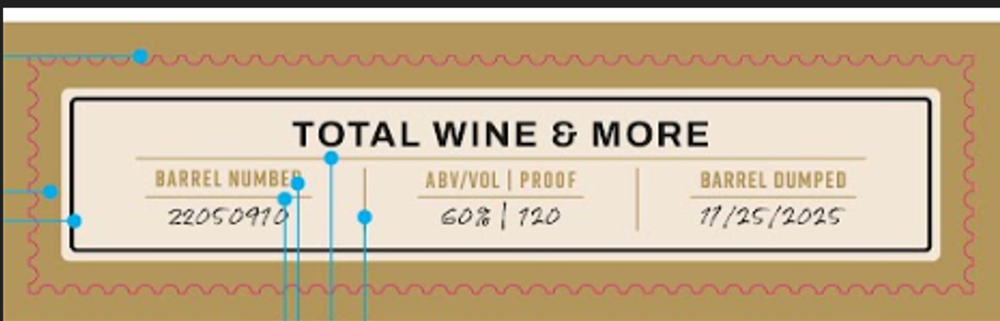

# TTB COLA Label Images - TTBID 26257001000492

**Brand Name:** STILL AUSTIN

**Fanciful Name:** SINGLE BARREL RYE PROGRAM

**Issue Date:** 09/18/2026

**Origin Code:** 44

**Product Class/Type:** 102

**Source:** [TTB Public COLA Registry](https://ttbonline.gov/colasonline/viewColaDetails.do?action=publicFormDisplay&ttbid=26257001000492)

## Label Images

### Back Label

### Front Label

### Label 2

### Label 4

## Extracted Label Text

*Text extracted via OCR - may contain errors*

### Back Label

STILL AUSTIN
SINGLE BARREL CASK STRENGTH
StRAIGHT
RYE
WAISKEY
The distinctive rye whiskey inside this bottle has
been extracted from a single barrel,
hand-selected
by our distillers for its unusually complex flavor
profile. This higher-proof spirit contributes to a
more dynamic and robust flavor; with tasting notes
ranging from candied ginger to lemon zest, from
muddled cherries to mint leaves. The result is an
audacious spirit,
marriage of brash rye piquancy
and subtle, lingering undertones
CERTIFIED
AGED AT LEAST
TEXAS
YEARS
MASTER distilLer; John Schrepel
WHISKEY
DRIN K locally: ENJOY RESPONSIBLY.
STILLAUSTIN.COM *
DISTILLED BY STILL AUSTIN WHISKEY CO;
AUSTIN, TEXAS; USA
750ML
CACV
GOVERNMENT WARNING: (1) ACCORDING TO
8
THE SURGEON GENERAL, WOMEN SHOULD
NOT DRINKALCOHOLIC BEVERAGES DURING
PREGNANCY BECAUSE OF THE RISK OF BIRTH
DEFECTS: (2) CONSUMPTION OF ALCOHOLIC
3
BEVERAGES IMPAIRS YOUR ABILITY TO DRIVE
A CAR OR OPERATE MACHINERY AND MAY
CAUSE
HEALTH
PROBLEMS.

### Front Label

100 %
GRAIN
TEXAS MADE
To GLASS
STILL AuSTIN
Limited
SINGLE BARREL
RELEASE
CASK StRENGTH
STRAIGHT RYE WHISKEY
'SinGLE
BARREL
0
HAND
SELECTED

### Label 2

TOTAL WINE & MORE
BaRREL MUMBEE
ABWIVOL
Proof
BaRael dumpEd
22050910
66;
720
11 /25[202,

### Label 4

SINGLE BARREL CASK STRENGTH

HLONIULS WSVO 197uNVE ITINIS

x
