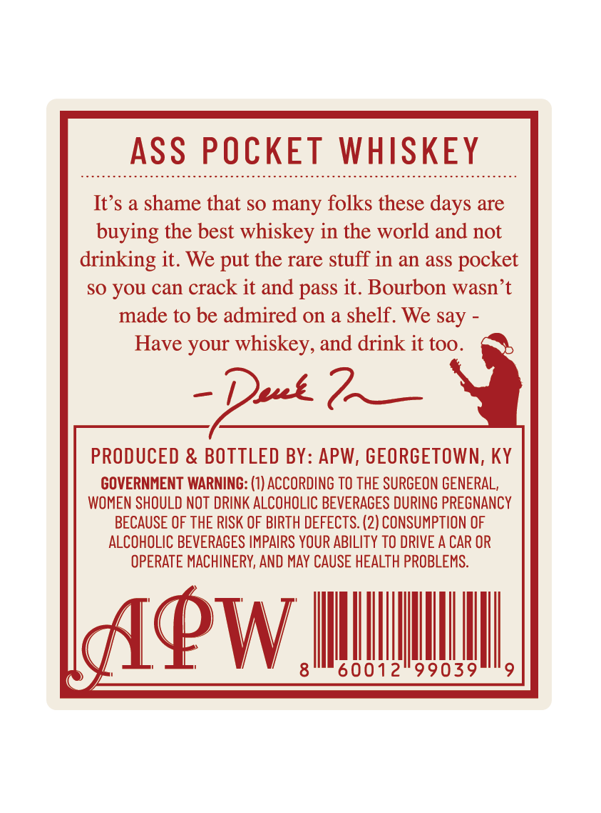
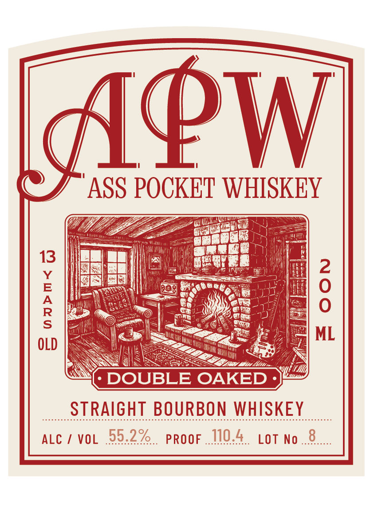

# TTB COLA Label Images - TTBID 26257001000511

**Brand Name:** APW

**Issue Date:** 09/30/2026

**Origin Code:** 22

**Product Class/Type:** 101

**Source:** [TTB Public COLA Registry](https://ttbonline.gov/colasonline/viewColaDetails.do?action=publicFormDisplay&ttbid=26257001000511)

## Label Images

### Back Label

### Front Label

## Extracted Label Text

*Text extracted via OCR - may contain errors*

**Detected Proof:** 110.4

### Back Label

ASS POCKET WHISKEY
It's a shame that so many folks these days are
buying the best whiskey in the world and not
drinking it. We put the rare stuff in an asS pocket
so You can crack it and pass it. Bourbon wasn t
made to be admired on a shelf. We say
Have your whiskey, and drink it too_
Duce
PRODUCED & BOTTLED BY: APW, GEORGETOWN; KY
GOVERNMENT WARNING: (1) ACCORDING TO THE SURGEON GENERAL,
WOMEN SHOULD NOT DRINK ALCOHOLIC BEVERAGES DURING PREGNANCY
BECAUSE OF THE RISK OF BIRTH DEFECTS: (2) CONSUMPTION OF
ALCOHOLIC BEVERAGES IMPAIRS YOUR ABILITY TO DRIVE A CAR OR
OPERATE MACHINERY, AND MAY CAUSE HEALTH PROBLEMS:
APW
8
60012"99039

### Front Label

ApW
ASS POCKET WHISKEY
30
13
OeeDU
ITO""
1
2
8
Baa
9044
187
ML
OLD
Iu
DOUBLE OAKED
STRAIGHT BOURBON WHISKEY
ALC
VOL
55.2%
PROOF
110.4
LOT No
8
6re
Kouc
8
Wace
