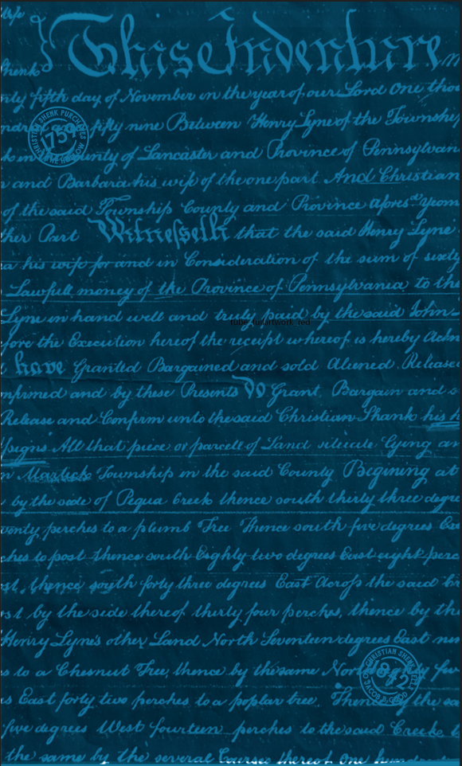
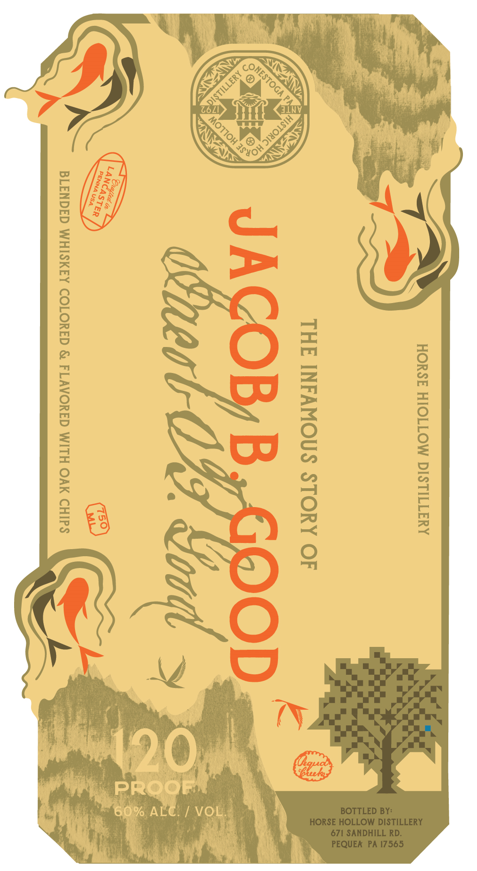
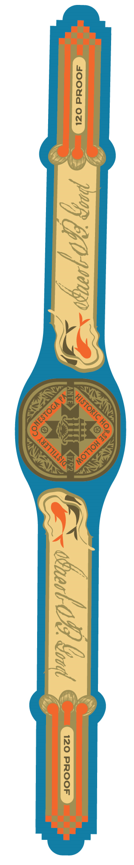
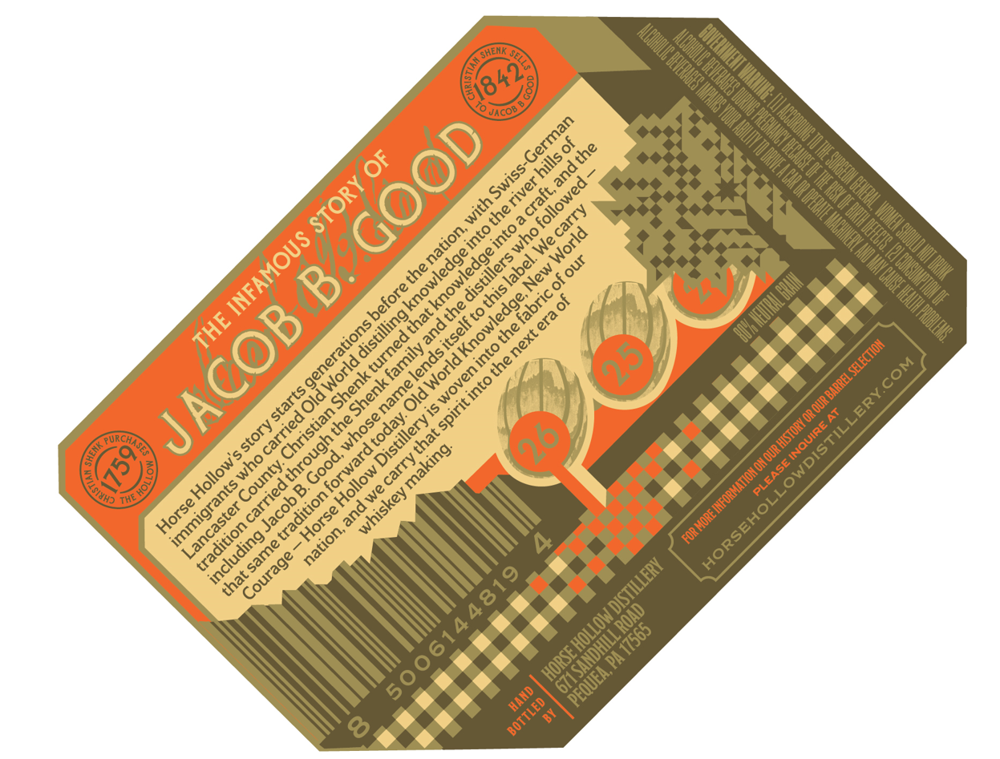
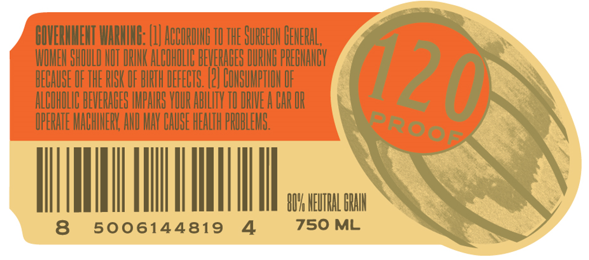

# TTB COLA Label Images - TTBID 26257001000522

**Brand Name:** HORSE HOLLOW DISTILLERY

**Fanciful Name:** JACOB B. GOOD CONESTOGA BLENDED WHISKEY

**Issue Date:** 10/07/2026

**Origin Code:** 39

**Product Class/Type:** 137

**Source:** [TTB Public COLA Registry](https://ttbonline.gov/colasonline/viewColaDetails.do?action=publicFormDisplay&ttbid=26257001000522)

## Label Images

### Back Label

### Front Label

### Label 2

### Label 5

### Label 6

## Extracted Label Text

*Text extracted via OCR - may contain errors*

*1 image(s) excluded: text did not meet readability threshold*

### Back Label

Iunk
Gltsehuoenh;)8
hly Ht daut
buu u
thyeadk ounSerob
On thod
ViymnOsrotrv
#pdt gwnsk
Nm
Samcastwv amd Ohavimeed] Ommaylvan
vamd Udoubana
wief thvonefsot tol hustear
Id Ahvooic
hif
andl
(iovinc
apres"aton
hwv Oub
Oiresalzz
Ihab thwu oaud
lv
Fuswtfo Jor-cnob
Bonsicalioro Ih fum
uxly
mnoney d Iko Ohoinewe} Ceaytvaman ta Uh
mvhoml wrll tmol
buulyafcuce
by thwocud Ihmv
Ord
t Beeulior huuo] theecefhwheuek t hrby Uck
kave %antucb Obargamedamat solct GUlzerucb Gcleaset
mtmd and
1y thuse (husenls
Snat;
acl
Rebase and
unklo theoaud Bhisliu hamko his
ss Atb thab-puire av [ovcele %_Samnct vkeecte
"Byenz
Mahck"Jownshf mv Ahe acud
Ts,rz
ab
bytkocbg Oequa buek lhoncu
veny
to a
fsuvms 'e
Ihenee ooulhv fnvdtgrues &
h totosl Lhonev ovulh
@ghly-tevo degpees Geuabezheshene
M,Vry
"Aty luo dqnus Bant Uonz Akoocece
ba
6y Uhwotov
fowv fechus; Ahence by tha
~Iymus,
Somo Xorth
Ivmbenxly 78b
ehsnub ehr Ihonoe By tksnson Nor
28
fovty tivo fenohd lowv foflawv
%nnos
Itw
fwe d.q
nu
Wusb fountu
poxchea
Io
theoauob SBaea &e
th
Tmni
buUho Jensal
9 Xoutm
Hhrvt
lnty g
rhws
Hey -
LiU
Jut
Osansourv
bortuvnv
Boumly
Mvuvd
Oouth
luull
frvhus
doulh
Aheud
Ahuuly
'Horiy
olhv
926
@st
nan

### Front Label

HORSE HIOLLOW DISTILLERY

THE INFAMOUS STORY OF

toed OF Sind S

### Label 5

6
0
4e
1
Q
8
6
42
PURCHA
3
4
Q
The
6'
843
JacOD
German
8
Ithe
hills =
4
Swiss-C
and =
STORY =
river
followed
craft;:
with 3
the=
carry
9
into =
1
into -
nation; -
who '
World
1
0
 knowledgei
cknowledgei
distillers
this label
our
the=
New
before -
fabric =
Old World Knowledge;
1
lends itself to '
4
ACOB
that L
'distilling |
era =
THE
L
the
next €
turned -
LSelEcTion
1
Shenk family :
World
COM
Shenk
|
into '
name
starts =
LERY.
1
Distillery is -
Christian =
{INQUIRE AT
1
whose E
1forward today:
the =
story
5
TILI
that =
through =
making:
HORSEHOLLOWDIS
Good;
carry
Hollow'
who
PLEASE
County;
 Hollow E
6
1
immigrants `
we 5
whiskey
1
Jacob)
Horse
Lancaster
3
Horse
1
nation,
including _
same
Courage -
1
4819
that :
E
1
1
HAND
BOTTLED

### Label 6

HIVERHMEHT WHRHIHR: (I| ABBORIHE TU THE SuRbEOH BEHERAL ,
WIMEH BHDULD HUT IRHHK ALBUHILIE BEVEHABES DURHE PREHHHHBY
HECHUBE IF THE RSK IF BIRTH DEFECTS. |?| GOHBUMPTHH IF
ALBUHILIE BEVERABES IHPHRS YIUR ABLFTY TI DRIVE A BAr IR
IPERATE MABHIHEHY AHI HAY BAUSE HEALTH PHOBLEHS.
HUH HEHTRAL BRH
8
5006144819
4
750 ML
120
proop
