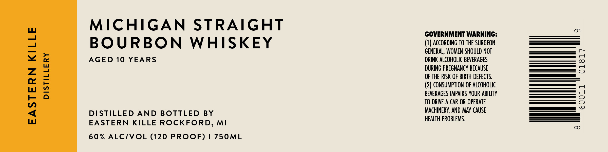

# TTB COLA Label Images - TTBID 26257001000592

**Brand Name:** EASTERN KILLE DISTILLERY

**Issue Date:** 09/16/2026

**Origin Code:** 06

**Product Class/Type:** 101

**Source:** [TTB Public COLA Registry](https://ttbonline.gov/colasonline/viewColaDetails.do?action=publicFormDisplay&ttbid=26257001000592)

## Label Images

### Label 1

## Extracted Label Text

*Text extracted via OCR - may contain errors*

**Detected Proof:** 120
**Detected Age:** 10 Years

### Label 1

MICHIGAN STRAIGHT

GOVERNMENT WARNING:

BOURBON WHISKEY

(1) ACCORDING TO THE SURGEON

GENERAL, WOMEN SHOULD NOT

AGED 10 YEARS

DRINK ALCOHOLIC BEVERAGES

DURING PREGNANCY BECAUSE

OF THE RISK OF BIRTH DEFECTS.

(2) CONSUMPTION OF ALCOHOLIC

BEVERAGES IMPAIRS YOUR ABILITY

TO DRIVE A CAR OR OPERATE

DISTILLED AND BOTTLED BY

MACHINERY, AND MAY CAUSE

HEALTH PROBLEMS.

EASTERN KILLE ROCKFORD, MI

60% ALC/VOL (120 PROOF) | 750ML
