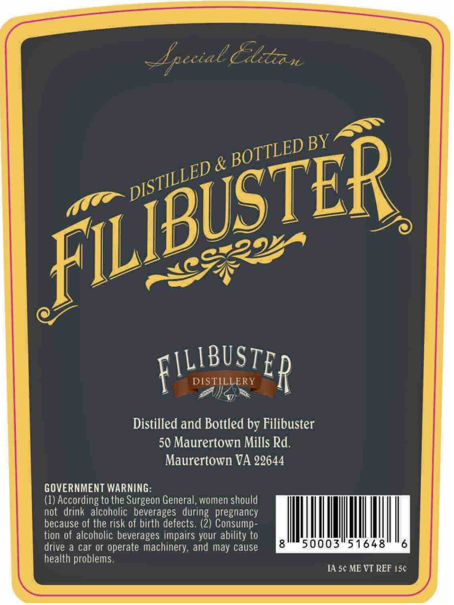
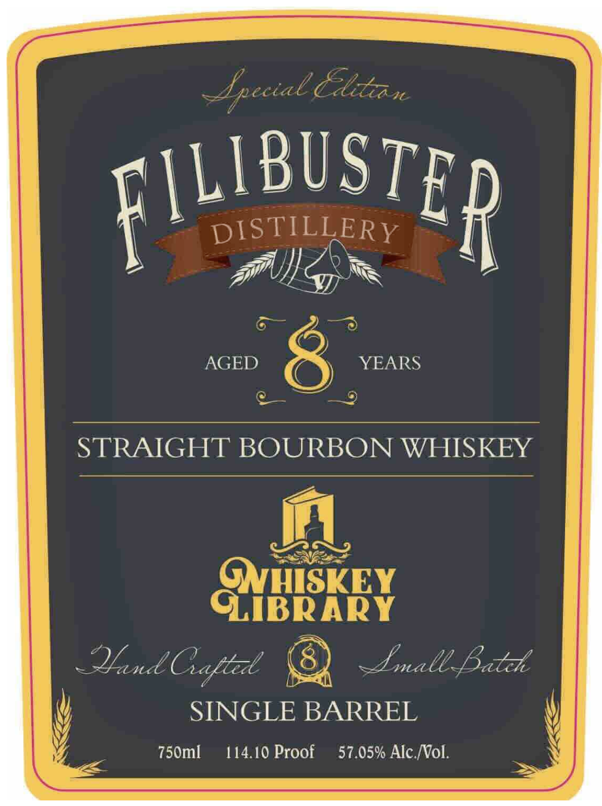

# TTB COLA Label Images - TTBID 26257001000641

**Brand Name:** WHISKEY LIBRARY

**Issue Date:** 10/07/2026

**Origin Code:** 05

**Product Class/Type:** 101

**Source:** [TTB Public COLA Registry](https://ttbonline.gov/colasonline/viewColaDetails.do?action=publicFormDisplay&ttbid=26257001000641)

## Label Images

### Back Label

### Front Label

## Extracted Label Text

*Text extracted via OCR - may contain errors*

**Detected Proof:** 114.1

### Back Label

Epeeial Cltca
&
FILIBUSTER
DISTILLERY
Distilled and Bottled by Filibuster
50 Maurertown Mills Rd.
Maurertown VA 22644
GOVERNMENT WARNING:
(1) According to the Surgeon General, women should
not  drink alcoholic   beverages  during   pregnancy
because of the risk of birth defects: (2) Consump
tion of alcoholic beverages impairs your ability to
drive a car or operate machinery; and may cause
8
50003
51648
6
health problems:
I4 5c ME VT REF I56
BY
BOTTLED
FILIBUSTER
DISTILLED

### Front Label

Epecial Clteauc
FILIBUSTER
DISTILLERY
AGED
YEARS
STRAIGHT BOURBON WHISKEY
GNHISKEY
GLiBRARY
QndCatlzl
~Emale Batzke
SINGLE BARREL
750ml
114.10 Proof
57.05% Alc NVol.
