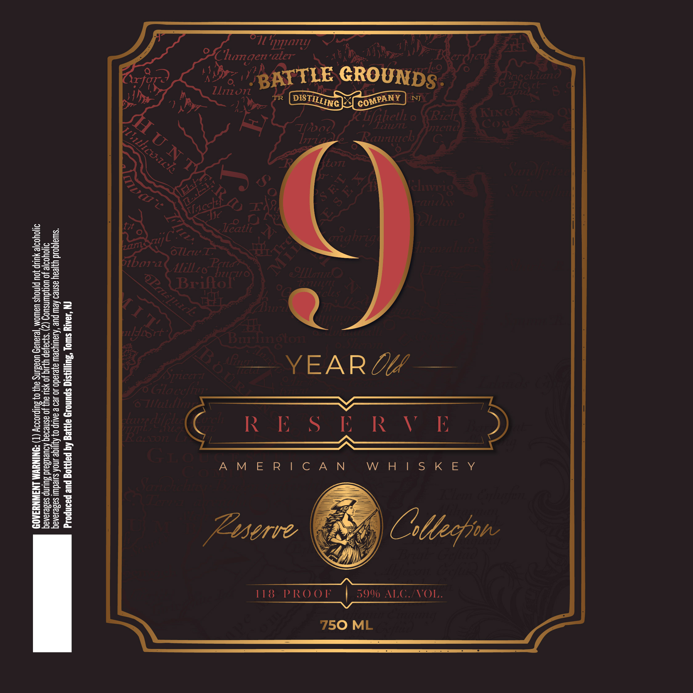

# TTB COLA Label Images - TTBID 26257001000675

**Brand Name:** BATTLE GROUNDS DISTILLING COMPANY

**Fanciful Name:** 9 YEAR OLD RESERVED

**Issue Date:** 10/06/2026

**Origin Code:** 03

**Product Class/Type:** 140

**Source:** [TTB Public COLA Registry](https://ttbonline.gov/colasonline/viewColaDetails.do?action=publicFormDisplay&ttbid=26257001000675)

## Label Images

### Label 1

## Extracted Label Text

*Text extracted via OCR - may contain errors*

### Label 1

g.
© ja
3

R
6
w
N
SS
S
i)
A

:
:
11 iy

ys AB

WTA IS a |e YY?

@

—YEAR“ZY —

AMERICAN

IN ‘JOAIY Swuoy “SUNIISIG spunosy aAyeg Aq payy30g pue paonpold

“Swwa|qgold yyjeay asneo Aew pue ‘Aauiyoew ayesado 10 129 & aAUp 0} AyIjIge snk sutedu sadesanaq
JH}o\yod|e Jo UORdunsuog (2) ‘s}9—}ap yIulq Jo YSU aly Jo asneoaq ADueUBald Suunp sasesanaq
9}]OYOo}2 YULIP JOU pnoYs UEWOM "jexeueH UORBLNS ayy 0} BUIPLODIY (T) *9NINAWA LNAWNYSAOD

PROO I

1138
