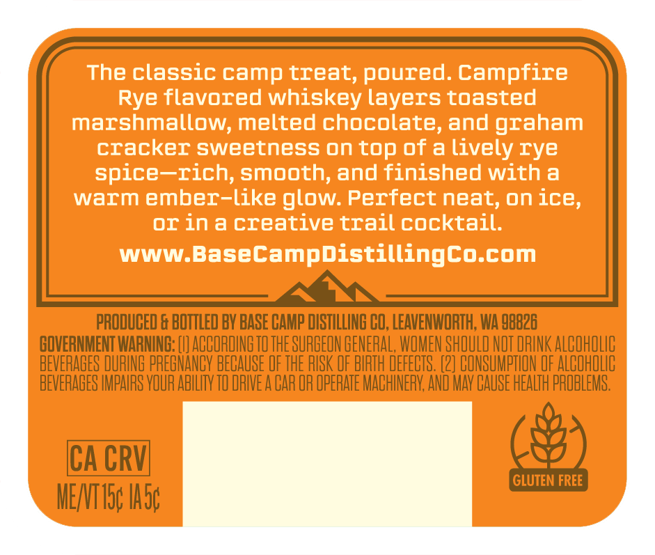
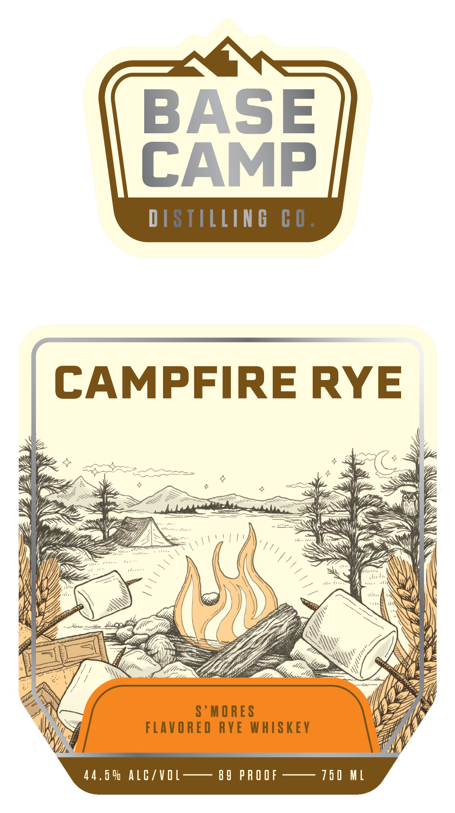

# TTB COLA Label Images - TTBID 26257001000729

**Brand Name:** BASE CAMP DISTILLING CO.

**Fanciful Name:** CAMPFIRE RYE

**Issue Date:** 09/22/2026

**Origin Code:** 07

**Product Class/Type:** 149

**Source:** [TTB Public COLA Registry](https://ttbonline.gov/colasonline/viewColaDetails.do?action=publicFormDisplay&ttbid=26257001000729)

## Label Images

### Back Label

### Front Label

## Extracted Label Text

*Text extracted via OCR - may contain errors*

### Back Label

The classic camp treat, poured. Campfire
Rye flavored whiskey layers toasted
marshmallow, melted chocolate, and graham
cracker sweetness on top of a lively rye
spice-rich; smooth;and finished With a
warm ember-like
glow: Perfect neat, on ice,
OI ina creative trailcocktail:
WWW.BaseCampdistillingco.com
PRODUCED & BOTTLED BY BASE CAMP DISTILLING CO; LEAVENWORTH; WA 98826
GOVERNMENT WARNING: [L] ACCORDING TO THE SURGEON GENERAL; WOMEN SHOULD NOT DRINK ALCOhOlIC
BEVERABES DURING PREGNANCY BECAUSE OF THE RISK OF BIRTH DEFECTS. (2] CONSUMPTION OF ALCOhOLIC
BEVERABES IMPARS VOUR ABILITY TO ORIVE A CAR OR OpeRATE MACHINERY; AND MAY CAUSE HEALTh PROBLEMS.
CA CRVI
GLUTEN FREE
MENTI5c Iasc

### Front Label

BASE
CAMP
DISTILLIN G
C 0 .
CAMPFIRE RYE
skoo
S ' M ORES
FLAVORED RYE WHISKEY
44 ,6 0 AlC/VOL
8 9 PR OOF
15 0 ML
