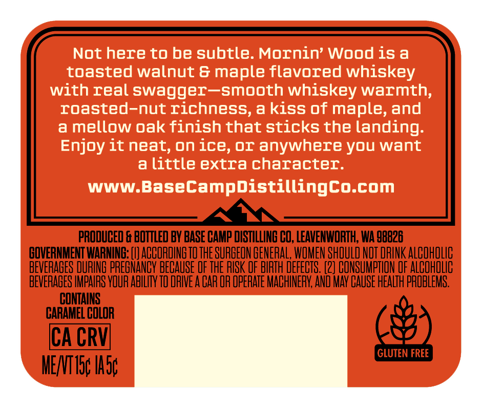
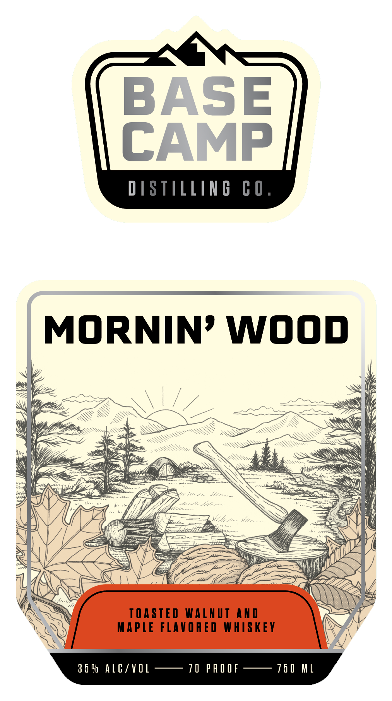

# TTB COLA Label Images - TTBID 26257001000735

**Brand Name:** BASE CAMP DISTILLING CO.

**Fanciful Name:** MORNIN' WOOD

**Issue Date:** 09/17/2026

**Origin Code:** 07

**Product Class/Type:** 149

**Source:** [TTB Public COLA Registry](https://ttbonline.gov/colasonline/viewColaDetails.do?action=publicFormDisplay&ttbid=26257001000735)

## Label Images

### Back Label

### Front Label

## Extracted Label Text

*Text extracted via OCR - may contain errors*

### Back Label

Not here to be subtle. Mornin' Wood is a
toasted walnut & maple flavored whiskey
with real swagger-smooth whiskey warmth;
roasted-nut richness,akiss of maple, and
a mellow oak finish that sticks the landing:
Enjoy it neat, on ice,Or anywhere you want
a
little extra character:
WWW.BaseCampdistillingco.com
PRODUCED & BOTTLED BY BASE CAMP DISTILLING CO, LEAVENWORTH; WA 98826
GOVERNMENT WARNING: [I] ACCORDING TO THE SURBEON GENERAL, WOMEN SHOULD NOT DRINK ALCOHOLIC
BEVERABES DURING PREGNANCY BECAUSE OF THE RISK OF BIRTH DEFECTS. (2] CONSUMPTHON OF ALCOHOLIC
BEVERAGES IMPAIRS VOUR ABHLHTY TO DAIE A CAR OR OpERATE MACHINERK; AND MAY GAuSE HeaLth PROBLEMS:
CONTAINS
CARAMEL COLOR
ICA CRVI
GLUTEN FREE
MENTISc Iasc

### Front Label

BASE
CAMP
DISTILLIN B
C O .
MORNIN' WOOn
0_-
TASTED WALnut AnD
MAPLe FLAVORED
WHISKEY
3 5 D AlC/V Q[
10 PR O OF
75 0 M[
