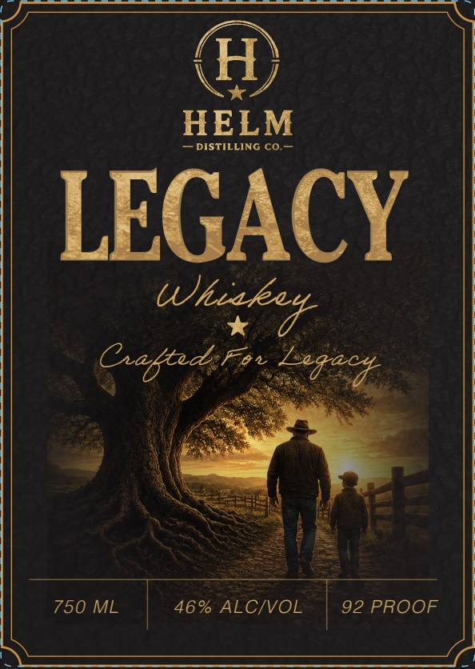

# TTB COLA Label Images - TTBID 26258001000060

**Brand Name:** HELM DISTILLING CO.

**Fanciful Name:** LEGACY

**Issue Date:** 10/01/2026

**Origin Code:** 39

**Product Class/Type:** 140

**Source:** [TTB Public COLA Registry](https://ttbonline.gov/colasonline/viewColaDetails.do?action=publicFormDisplay&ttbid=26258001000060)

## Label Images

### Back Label

### Front Label

## Extracted Label Text

*Text extracted via OCR - may contain errors*

**Detected Proof:** 92

### Back Label

OUR LEGACY IS BUILT
ONE GENERATION AT A TIME.
Legacy is more than & name: It $ the foundation
we were built on and the future we re building for
Crafted from time-honored recipes and
relentless
commitment to quality, this whiskey is our promise
to leave
something worth remembering:
Not because it'$ easy
Because it'$ worth it.
LEAVE SOMETHING
WORTH REMEMBERING.
Bottled By:
Helm
URG PENISYEYANCo .
STRASBURG;
H
GOVERNMENT WARNING:
ACCORDING To THE SuRGEON GENERAL WOMEN shouLd Not DRINK ALCOHOLIC
BEVERAGES DURING PREGNANCY BECAUSE OF THE RISK OF BIRTH DEFECTS. (2) CONSUMPTION OF ALCOHOLIC
BEVERAGES IMPAIRS YOUR ABILITY TO DRIVE A CAR OR OPERATE MACHINERY; AND MAY CAUSE HEALTH PROBLEMS_

### Front Label

H
HELM
DISTILLING co;
LEGACY
Gabted Fon
750 ML
46% ALCIVOL
92 PROOF
Whiked
Leqacd
