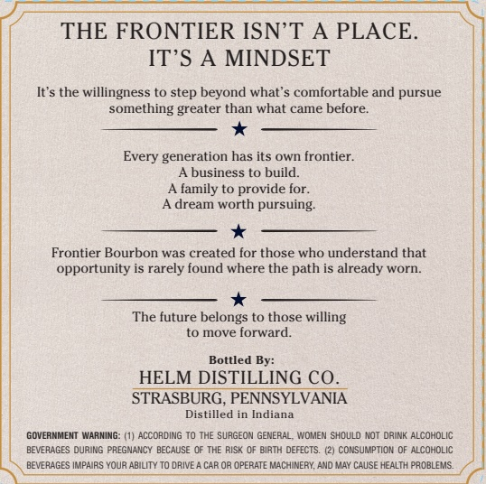

# TTB COLA Label Images - TTBID 26258001000065

**Brand Name:** HELM DISTILLING CO.

**Fanciful Name:** FRONTIER

**Issue Date:** 10/01/2026

**Origin Code:** 39

**Product Class/Type:** 101

**Source:** [TTB Public COLA Registry](https://ttbonline.gov/colasonline/viewColaDetails.do?action=publicFormDisplay&ttbid=26258001000065)

## Label Images

### Front Label

## Extracted Label Text

*Text extracted via OCR - may contain errors*

### Front Label

THE FRONTIER ISN'T
A PLACE:
IT'S A
MINDSET
It'$ the willingness t0 step beyond what'$ comfortable and pursue
something greater than what came before:
Every generation has its own frontier:
A business to build:
family to provide for.
A dream worth pursuing
Frontier Bourbon was created for those who understand that
opportunity is rarely found where the path is already worn:
The future belongs t0 those willing
to mnove forward.
Bottled By:
HELM DISTILLING CO_
STRASBURG, PENNSYLVANIA
Distilled in Indiana
GOVERNMENT WARMING
(1) AcCORDING To THE SURGEON GENERAL; WOMEN Should NoT dRink ALCOHOLIC
BEVERAGES DURING PREGNANCY BECAUSE OF THE RiSk OF BiRTH DEFECTS.
(2) consumption OF ALCOHOLIC
BEVERAGES IMPAURS YOUR ABILITY TO DRIVE A CAR OR OPERATE MACHINERY. AND MAY CAUSE HEALTH PROBLEMS
