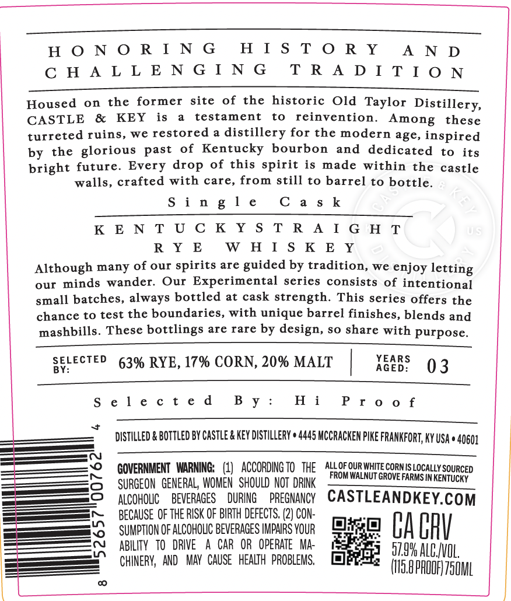
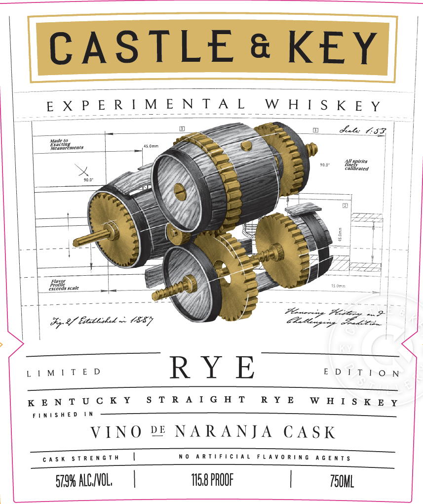
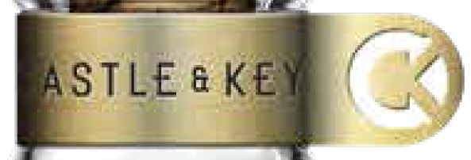

# TTB COLA Label Images - TTBID 26258001000145

**Brand Name:** CASTLE & KEY

**Fanciful Name:** EXPERIMENTAL WHISKEY

**Issue Date:** 09/23/2026

**Origin Code:** 22

**Product Class/Type:** 102

**Source:** [TTB Public COLA Registry](https://ttbonline.gov/colasonline/viewColaDetails.do?action=publicFormDisplay&ttbid=26258001000145)

## Label Images

### Back Label

### Front Label

### Label 2

### Label 3

## Extracted Label Text

*Text extracted via OCR - may contain errors*

*2 image(s) excluded: text did not meet readability threshold*

**Detected Proof:** 158

### Back Label

HONORING HISTORY AND
CHALLENGING TRADITION

Housed on the former site of the historic Old Taylor Distillery,
CASTLE & KEY is a testament to reinvention. Among these
turreted ruins, we restored a distillery for the modern age, inspired
by the glorious past of Kentucky bourbon and dedicated to its
bright future. Every drop of this spirit is made within the castle

walls, crafted with care, from still to barrel to bottle.

Single Cask

KENTUCKYSTRAIGHT
RYE WHISKEY
Although many of our spirits are guided by tradition, we enjoy letting
our minds wander. Our Experimental series consists of intentional
small batches, always bottled at cask strength. This series offers the
chance to test the boundaries, with unique barrel finishes, blends and
mashbills. These bottlings are rare by design, so share with purpose.

SELECTED 63% RYE, 17% CORN, 20% MALT YEARS 3

Proof

Selected By: Hi

+

DISTILLED & BOTTLED BY CASTLE & KEY DISTILLERY # 4445 MCCRACKEN PIKE FRANKFORT, KY USA © 40601

GOVERNMENT WARNING: (1) ACCORDINGTO THE ALLOrouRWHTE comus.ocauy souncen
SURGEON GENERAL, WOMEN SHOULD NOT DRINK UTGROVEFARMS INKENTUCKY

FROMWALNUT GROVE FARMS IN KENTUCKY
ALCOHOLIC BEVERAGES DURING PREGNANCY CASTLEANDKEY.COM
BECAUSE OF THE RISK OF BIRTH DEFECTS, (2) CON-

SUMPTION OF ALCOHOLIC BEVERAGES IMPAIRS YOUR Bi
ABILITY TO DRIVE A CAR OR OPERATE MA- ae CAGRY
CHINERY, AND MAY CAUSE HEALTH PROBLEMS. item co

5265700762

8

### Front Label

CASTLE & KEY

i

(EXPERIMENTAL

(WHISKEY

450mm

Sales IP,

a

Eis

|__+ —

|. 4---

OZ

eee

Sg 8 fetatishad < OY

Hoge 9

LIMITED

RYE

EDITION

KENTUCKY

STRAIGHT

RYE

WHISKEY

FINISHED IN

VINO PE NARANJA CASK

CASK STRENGTH

|

NO ARTIFICIAL FLAVORING AGENTS

579% ALCVOL

|

1158 PROOF

|

7S0ML
