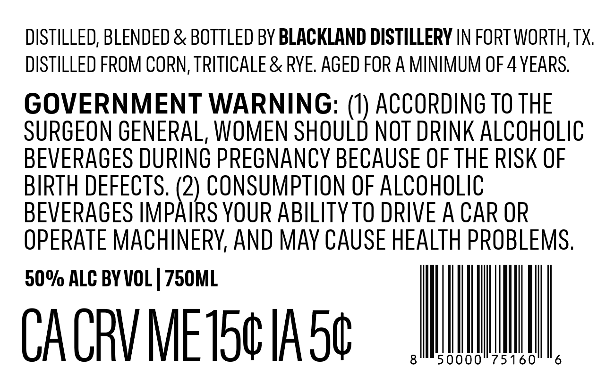
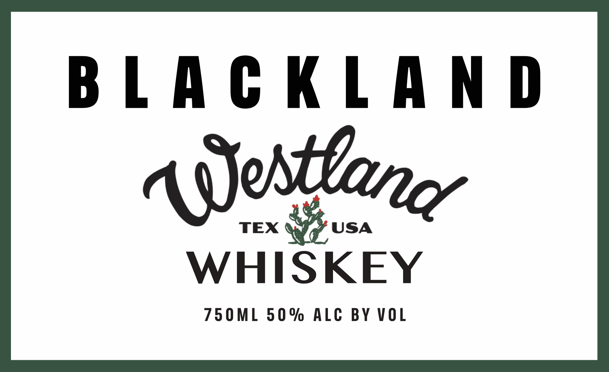

# TTB COLA Label Images - TTBID 26258001000232

**Brand Name:** WESTLAND WHISKEY

**Issue Date:** 09/18/2026

**Origin Code:** 44

**Product Class/Type:** 140

**Source:** [TTB Public COLA Registry](https://ttbonline.gov/colasonline/viewColaDetails.do?action=publicFormDisplay&ttbid=26258001000232)

## Label Images

### Back Label

### Front Label

## Extracted Label Text

*Text extracted via OCR - may contain errors*

**Detected Proof:** 100
**Detected Age:** 4 Years

### Back Label

DISTILLED, BLENDED & BOTTLED BY BLACKLAND DISTILLERY IN FORT WORTH, TX
DISTILLED FROM CORN, TRITICALE & RVE: AGED FOR A MINIMUM OF 4 YEARS
GOVERNMENT WARNING: (U) ACCORDING TO THE
SURGEON GENERAL, WOMEN SHOULD NOT DRINK ALCOhOLIC
BEVERAGES DURING PREGNANCY BECAUSE OF THE RISK OF
BIRTH DEFECTS. (2) CONSUMPTION OF ALCOHOLIC
BEVERAGES IMPAIRS YOUR ABILITY TO DRIVE A CAR OR
OPERATE MACHINERV, AND MaV CAUSE HEALTH PROBLEMS .
50% ALC BY VOL | 75OML
CA CRV MEIScIA 5c
50000
75160
6

### Front Label

BLACKLAND

TEX

USA

WHISKEY

750ML 50% ALC BY VOL
